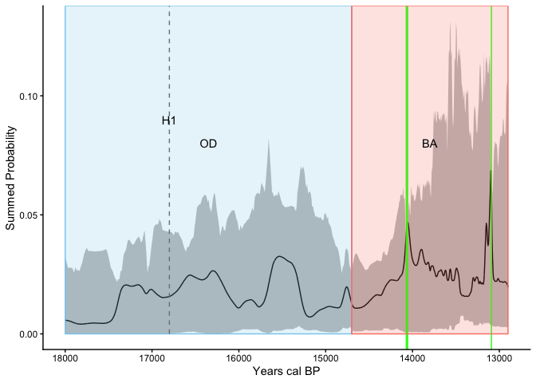
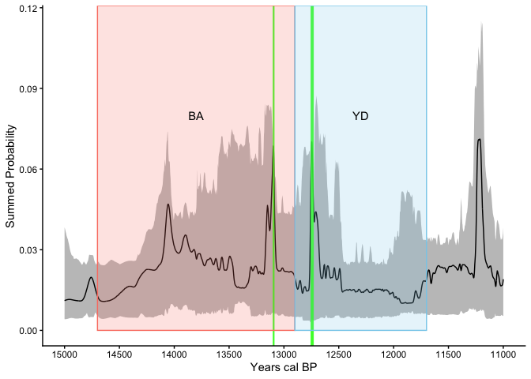
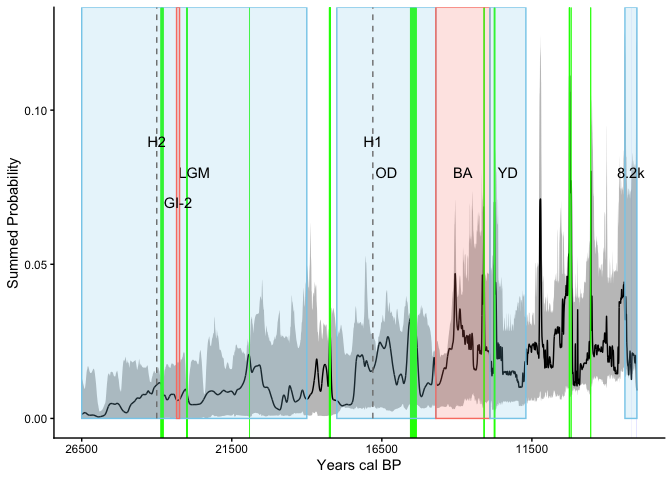
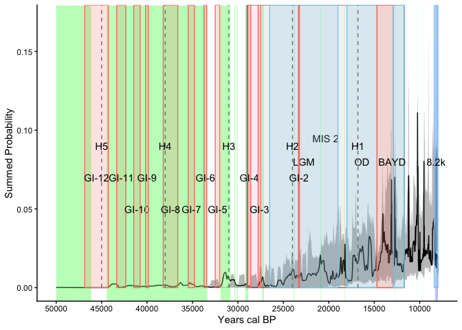
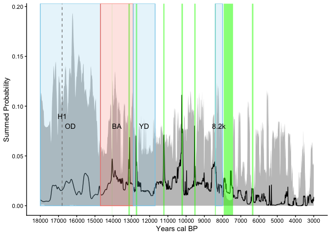
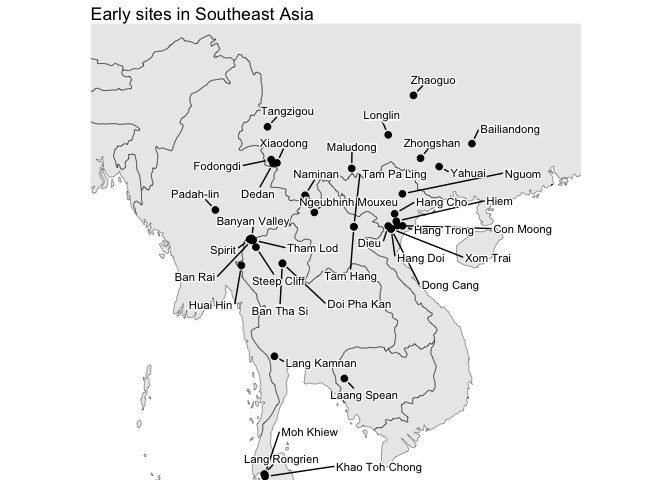
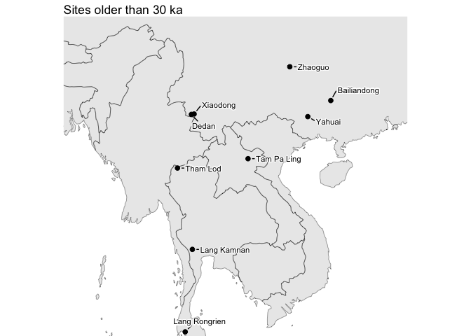
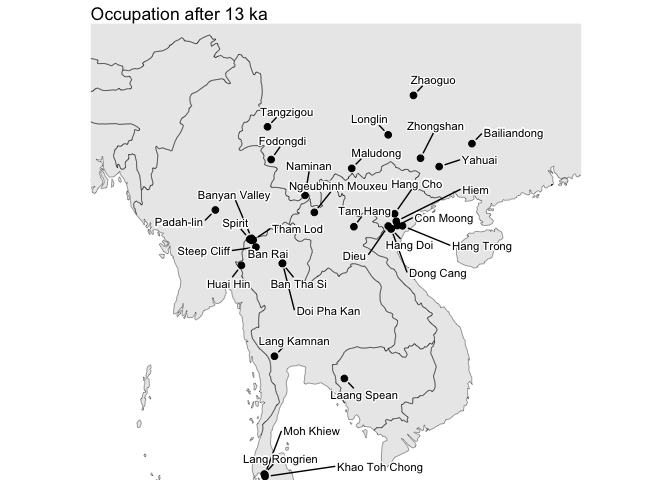
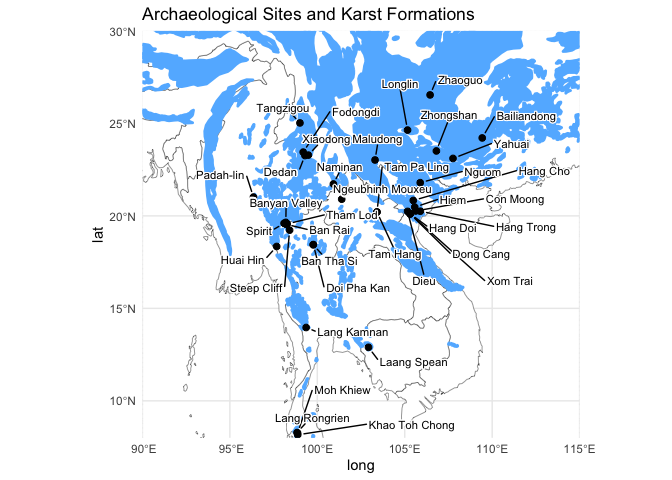

# Using radiocarbon ages as a proxy for human population dynamics in
late Pleistocene mainland Southeast Asia


``` r
library(tidyverse)
```

    ── Attaching core tidyverse packages ──────────────────────── tidyverse 2.0.0 ──
    ✔ dplyr     1.2.0     ✔ readr     2.1.6
    ✔ forcats   1.0.1     ✔ stringr   1.6.0
    ✔ ggplot2   4.0.2     ✔ tibble    3.3.1
    ✔ lubridate 1.9.5     ✔ tidyr     1.3.2
    ✔ purrr     1.2.1     
    ── Conflicts ────────────────────────────────────────── tidyverse_conflicts() ──
    ✖ dplyr::filter() masks stats::filter()
    ✖ dplyr::lag()    masks stats::lag()
    ℹ Use the conflicted package (<http://conflicted.r-lib.org/>) to force all conflicts to become errors

``` r
library(readxl)
library(rcarbon)
```


    Attaching package: 'rcarbon'

    The following object is masked from 'package:dplyr':

        combine

``` r
# Read excel sheet with dates across Southeast Asia and southern China
dates <- read_excel("Demographic analysis sites.xlsx")

n_site <- length(unique(dates$Site))

# Calibrate dates using IntCal20
calDates <- calibrate(
  x = dates$C14Age,
  errors = dates$C14SD,
  calCurves = "intcal20",
  verbose = FALSE)
```

## Introduction

In this project we aim to conduct a demographic analysis of Mainland
Southeast Asia from the late Pleistocene. Using radiocarbon dates we
simulated population dynamics over time with summed probability
distribution plots. We compare the SPDs against climate events to
explain anomalous occupation dynamics. \[ BM: add a couple of research
questions that we will answer with our data \]

## Background

Early sites in Mainland Southeast Asia date back over 50 thousand years,
we will be exploring them under different climate events in order.

### Marine Isotope Stage 3 (57-29 ka)

The Marine Isotope Stage 3 is when humans started peopling Mainland
Southeast Asia preceeding the LGM (Fitch et al. 2025). Tam Pa Ling in
Laos boasts the earliest anatomically modern human fossil, the partial
human cranium found was dated using multiple methods, radiocarbon coming
out to 56.5k cal BP Demeter et al. (2012) (Demeter et al. 2012).
Xiaodong in Yunnan, China contains the earliest evidence of Hoabinhian
technology, being dated back from, 43.5-24.5 ka cal (Ji et al. 2016).
Another site in Yunnan with possible Hoabinhian technology during this
time period is Dedan (30.8 ka) although it remains unclear without more
artifacts (Wu et al. 2022). These sites have brought into question the
origins of the Hoabinhian possibly spreading from southern China. There
are a couple sites without evidence of the Hoabinhian, notably
Bailiandong (36 ka), Zhaoguo (33.4 ka), Yahuai (32.1-13.3 ka), in China
and Lang Rongrien (37.3-27.1 ka) and Lang Kamnan (30.1-6.1 ka) in
Thailand who used other lithic technologies (Zhou et al. 2019; Wei et
al. 2020; Wu et al. 2020; Anderson 1997; Shoocongdej 2000). The earliest
evidence of Hoabinhian in Thailand comes from Tham Lod dating to
34-12.1ka (Marwick and Gagan 2011, Chitkament et al. 2016), the site is
especially rich in lithics and fossils across its entire sequence.

### Marine Isotope Stage 2 (29-11.7 ka)

This time period is marked by more consistent cold (Fitch et al. 2025).
Before the Last Glacial Maximum, sites like Xiaodong, Lang Rongrien,
Lang Kamnan, and Tham Lod exhibit continued occupation from the
beginning of MIS 2.

The **Last Glacial Maximum (26.5-19 ka)** is marked by global cooling
(Clark et al. 2009) where it might be expected that occupation would be
less but there are still a number of sites dating to this time. After a
10 thousand year hiatus, Bailiandong resumes occupation during the LGM,
dating to 25.9-6.9 ka (Zhou et al. 2019). Xiaodong, Lang Kamnan, Tham
Lod, and Yahuai continues occupation during the LGM and a new Thai site
at Moh Khiew (25.8 ka) emerged. The Vietnamese Hoabinhian sites of Hang
Trong (20.5-10.8 ka), Hang Cho (19.6-8.4 ka) and Dieu (19.7 ka) first
emerge during the LGM (Rabett et al. 2017; Yi et al. 2008; Nguyen 2007).
Hang Trong is known for showing occupation adaption during the cold
period (Rabett et al. 2017). Hang Cho was subject to an extensive dating
program aiming to add more dates to Hoabinhian data (Yi et al. 2008).
Another site in Vietnam named Nguom also dates from the LGM (23-18.6 ka)
however it has been argued Hoabinhian tools only appeared at the end of
occupation (Anisyutkin and Timofeyev 2006).

Past the LGM Lang Kamnan, Hang Cho, Bailiandong, Tham Lod, and Hang
Trong continues to be occupied until the end of MIS 2. The Oldest Dryas
begins from 18 thousand to 14.7 thousand years ago, the period is marked
by another global cooling (Shakun and Clarkson 2010). After almost
14,000 years Dedan reemerges in the archaeological record for a thousand
years (16.3-15.2 ka) with confirmed Hoabinhian tools (Wu et al. 2022).
Xom Trai (17.5-17 ka) emerged in Vietnam for a brief time where
researchers there had to correct for reservoir ages for the mollusk
shells that were dated by 800 years (Görsdorf and Viet 1995).

The **Bølling–Allerød Interstadial (14.7-12.9 ka)** is of special
interest to us because it is a period of increased warmth globally in a
general cold period (Rasmussen et al. 2006). In southern China Maludong
(14.7-11.4 ka) and Naminan (14.2-12.9 ka) emerge without Hoabinhian
technology during the Bølling–Allerød Interstadial while Zhaoguo
reemerges (19.5-9.5 ka) after nearly 15 thousand years (Curnoe et
al. 2012, Lu et al. 2023, Wei et al. 2020). Similarly Khao Toh Chong in
Thailand (13-0.15 ka) emerges as another site without Hoabinhian.
Fodongdi in Yunnan (14-12.1 ka) is a Chinese site that does display
Hoabinhian tools alongside other lithic technologies during this time
(Huan et al. 2024). Myanmar’s only well dated Hoabinhian site Padah-lin
(13.4-1.8 ka) with its notable cave paintings also begins occupation
during this time (Thaw 1971). In Laos Tam Hang dates to 13.2-9.4 ka
where Hoabinhian tools like sumatraliths became smaller over time
(Patole-Edoumba et al. 2015). In Vietnam Con Moong with Hoabinhian
technology (13.1-9.1 ka) begins occupation being dated with shellfish
similarly to Xom Trai (Görsdorf and Viet 1995). The last Hoabinhian site
to emerge during the Bølling–Allerød is Doi Pha Kan in Thailand
(12.9-11.2 ka) which is notable for its well preserved burials used to
argue the similarity of culture across Southeast Asia and southern China
(Zeitoun et al. 2019).

The **Younger Dryas (12.9-11.7 ka)** is a global return to cooler
temperatures (Rasmussen et al. 2006). The only site to emerge during
this time is Zhongshan in China (12.3-7.8 ka) without Hoabinhian tools
(Tian et al. 2023).

## Marine Isotope Stage 1 (11.7 ka-present)

Our current Marine Isotope stage is warmer compared to the last one
(Fitch et al. 2025), many sites began occupation during this time. Many
Hoabinhian sites from MIS 2 persist into this period including Hang
Trong, Hang Cho, Padah-lin, Tam Hang, and Con Moong. In the first
millenia of MIS 1 many Hoabinhian Thai sites began emerging, Ban Tha Si
(11.4-6.7 ka) is a site with a preserved burial that was analyzed
(Zeitoun et al. 2012), Moh Khiew is reoccupied (11.3-4.3 ka) after 14
thousand years, Steep Cliff cave (11.2-5.2 ka) is interpreted as a
hunting mass-kill location, Spirit (11.3-3 ka) and Banyan Valley
(10.7-0.22 ka) caves similarly emerged with Banyan Valley being occupied
into historic periods (Conrad et al. 2012). In Vietnam 2 Hoabinhian
sites are inhabited for a brief time, Dong Cang and Hang Doi both only
being dated to 10.5 ka (Viet 2008). Cambodia’s only well dated
Hoabinhian site Laang Spean had its oldest layers dated to 71 ka with
OSL but the radiocarbon dates only go from 10-3.3 ka (Sophady et
al. 2016). Hiem cave (9.2-9 ka) is a short Hoabinhian lived site in
Vietnam where occupants exploited a large variety of food sources
(Masojć et al. 2023). Tangzigou (9-7.4 ka) is another site in China with
technology that isn’t Hoabinhian (Zhou et al. 2020). Ban Rai (8.9-6.6
ka) is a site in Thailand showing little change in technology as climate
changed (Marwick and Gagan 2011). Only dated to 3.7 ka, Huai Hin is
typically dated as the end of the Hoabinhian (Forestier et al. 2013).
Ngeubinh Mouxeu, is a site in Laos that contains both pre-Hoabinhian and
Hoabinhian lithics but the Hoabinhian layers couldn’t be dated, it is
only known they are older than 1.2 ka (Zeitoun et al. 2012).

## Data

We gathered 352 uncalibrated radiocarbon ages from 37 late Pliestocene
to early Holocene sites across Southeast Asia and southern China. For
one of the Chinese sites Xiaodong we had to uncalibrate the ages using
the built in feature in rcarbon.

## Methods

First we calibrated all the dates using IntCal20 in rcarbon, then we
made summed probability distributions and visualized it in a plots,
first without binning. Next to account for well dated sites
overshadowing sites with less amount of dates we binned the data by
different years to experiment. After the initial SPD plots we decided to
evaluate these our findings with a Monte-Carlo simulation approach to
check if taphonomic loss and calibration process affected the shape of
the plot. With an exponential growth model our Monte-Carlo simulations
were used to check 5 timelines, Oldest Dryas to Bølling–Allerød
Interstadial, Bølling–Allerød Interstadial to Younger Dryas, Marine
Isotope 3 to Last Glacial Maximum, , 50,000 years ago to 8.2-kiloyear
event and Last Glacial Maximum to 8.2-kiloyear event

## Results

The resulting plots are relatively consistent in peaks and show that
practically every period is accounted for \[ BM: edit this to be more
informative \]. The consistent increase in dates after 14,000 BP do call
for some investigation which is our current focus.

``` r
age_range <- c(50000,2000)

spd_unbinned <- spd(
  calDates,
  timeRange = age_range)
```

    [1] "Extracting and aggregating..."
    [1] "Done."

``` r
climate_events <- read_excel("Demographic analysis sites.xlsx", sheet = 2) |>
  filter(!is.na(`Climate event`)) |>
  mutate(
    Abbreviation = as.character(Abbreviation),
    midpoint = `End year` + (`Start year` - `End year`) / 2,
    colour = case_when(
      Condition == "warmer" ~ "salmon",
      Condition == "cooler" ~ "skyblue",
      is.na(Condition)      ~ "grey50"
    ),
    ymax = case_when(
  Abbreviation %in% c("LGM", "OD", "BA", "YD", "8.2k") ~ 0.09,
  is.na(Condition) ~ Inf,
  row_number() %% 2 == 0 ~ 0.08,
  TRUE ~ 0.06
    ),
    y_text = case_when(
  Abbreviation %in% c("MIS 3", "MIS 2", "MIS 1") ~ 0.095,
  Abbreviation %in% c("LGM", "OD", "BA", "YD", "8.2k") ~ 0.08,
  is.na(Condition) ~ 0.09,  # Heinrich events
  row_number() %% 2 == 0 ~ 0.07,
  TRUE ~ 0.05
    )
  )

climate_layers <- lapply(seq_len(nrow(climate_events)), function(i) {
  e <- climate_events[i, ]
  if (e$`Start year` == e$`End year`) {
    # Point events like Heinrich events → vertical line
    list(
      annotate("segment",
               x = e$`Start year`, xend = e$`Start year`,
               y = 0, yend = Inf,
               colour = "grey50", linetype = "dashed"),
      annotate("text",
               x = e$midpoint, y = 0.09,
               label = e$Abbreviation)
    )
  } else {
    list(
      annotate("rect",
               ymin = 0, ymax = e$ymax,
               xmin = e$`Start year`, xmax = e$`End year`,
               colour = e$colour, fill = e$colour,
               alpha = if_else(is.na(e$Condition), 0.1, 0.2)),
      annotate("text",
               x = e$midpoint, y = e$y_text,
               label = e$Abbreviation)
    )
  }
})

# Define this once alongside climate_events and climate_layers
climate_layers_for <- function(start_bp, end_bp) {
  events <- climate_events |> 
    filter(`Start year` <= start_bp & `End year` >= end_bp)
  
  lapply(seq_len(nrow(events)), function(i) {
    e <- events[i, ]
    if (e$`Start year` == e$`End year`) {
      list(
        annotate("segment",
                 x = e$`Start year`, xend = e$`Start year`,
                 y = 0, yend = Inf,
                 colour = "grey50", linetype = "dashed"),
        annotate("text",
                 x = e$midpoint, y = 0.09,
                 label = e$Abbreviation)
      )
    } else {
      list(
        annotate("rect",
                 ymin = 0, ymax = Inf,
                 xmin = e$`Start year`, xmax = e$`End year`,
                 colour = e$colour, fill = e$colour,
                 alpha = if_else(is.na(e$Condition), 0.1, 0.2)),
        annotate("text",
                 x = e$midpoint, y = e$y_text,
                 label = e$Abbreviation)
      )
    }
  })
}


ggplot(spd_unbinned$grid) +
  aes(calBP, PrDens) +
  geom_line() +
  climate_layers +
  scale_x_reverse() +
  theme_minimal() 
```


<a href="#fig-unbinned-climate" class="quarto-xref">Figure 1</a> shows a
SPD plot dating from 50-2 ka using all of the radiocarbon dates. There
is a continuous occupation of Southeast Asia from 50000 BP to present.
The peaks are relatively low until the LGM suggesting low occupation
without any sustained growth. During the LGM where the slowly increasing
rises, plataeus, and dips suggest a gradual intensification despite the
global cold. This intensification trend continues past the LGM with
extreme peaks in Bølling–Allerød Interstadial, Younger Dryas, and early
Holocene. The trend then declines after 8 ka. The extreme peak of the
Bølling–Allerød Interstadial are of interest because it might be
explained by the global warming of the event making Mainland Southeast
Asia more hospitable for the hunter gatherers, there is evidence of the
warming in speleothems from Vietnam and Thailand during this time
(Patterson et al. 2023; Jacobson et al. 2024).

``` r
# Initial Monte Carlo test for OD to BA
expnull <- modelTest(calDates, 
                      errors = dates$C14SD, 
                      model = "exponential", 
                      timeRange = c(18000, 12900), 
                      verbose = FALSE,
                      nsim = 100)
```

    Warning in modelTest(calDates, errors = dates$C14SD, model = "exponential", :
    Direct model fitting on SPDs can lead to biased estimates and Null Hypothesis

    Warning in modelTest(calDates, errors = dates$C14SD, model = "exponential", :
    edgeSize reduced

``` r
plot_df <- expnull$result
#Annotating climate events
ggplot(plot_df, aes(x = calBP)) +
  geom_ribbon(aes(ymin = lo, ymax = hi), fill = "grey70", alpha = 0.8) +
  geom_line(aes(y = PrDens), colour = "black") +
  # Highlight periods where observed exceeds envelope
  geom_vline(
    data = subset(plot_df, PrDens > hi | PrDens < lo),
    aes(xintercept = calBP),
    colour = "green", alpha = 0.3, linewidth = 0.3
  ) +
  scale_x_reverse(
    limits = c(18000, 12900),
    breaks = seq(18000, 12900, by = -1000)
  ) +
  labs(x = "Years cal BP", y = "Summed Probability") +
  climate_layers_for(18000, 12900)+
  theme_classic()
```



To verify our observations we used Monte Carlo tests, after testing 1000
and 100 simulations we found no difference in results and settled on 100
year simulations for our figures. Our tests used an exponential model
because our long timeline could skew our results from taphonomic loss.
<a href="#fig-MTCL1" class="quarto-xref">Figure 2</a> shows our testing
from the Oldest Dryas to Bølling–Allerød Interstadial, we see 2 minor
deviations where the line goes above the envelope near 14.1ka and 13.1ka
shown in green bars. Typically these positive deviations indicate a
period of intense population growth beyond the expectations of an
exponential model however given how short these deviations last,
possibly being only decades we cannot conclude for certain that there
was intensification of activity.

``` r
# Initial Monte Carlo test for BA-YD
expnull2 <- modelTest(calDates, 
                      errors = dates$C14SD, 
                      model = "exponential", 
                      timeRange = c(15000, 11000), 
                      verbose = FALSE,
                      nsim = 100)
```

    Warning in modelTest(calDates, errors = dates$C14SD, model = "exponential", :
    Direct model fitting on SPDs can lead to biased estimates and Null Hypothesis

    Warning in modelTest(calDates, errors = dates$C14SD, model = "exponential", :
    edgeSize reduced

``` r
plot_df2 <- expnull2$result

# Annotating climate events
ggplot(plot_df2, aes(x = calBP)) +
  geom_ribbon(aes(ymin = lo, ymax = hi), fill = "grey70", alpha = 0.8) +
  geom_line(aes(y = PrDens), colour = "black") +
  # Highlight periods where observed exceeds envelope
  geom_vline(
    data = subset(plot_df2, PrDens > hi | PrDens < lo),
    aes(xintercept = calBP),
    colour = "green", alpha = 0.3, linewidth = 0.3
  ) +
  scale_x_reverse(
    limits = c(15000, 11000),
    breaks = seq(15000, 11000, by = -500)
  ) +
  labs(x = "Years cal BP", y = "Summed Probability") +
  climate_layers_for(15000, 11000)+
  theme_classic()
```



<a href="#fig-MTCL2" class="quarto-xref">Figure 3</a> shows our testing
from Bølling–Allerød Interstadial to Younger Dryas, the same deviation
near 13.1ka is seen again while there is a new one in the Younger Dryas
near 12.8ka. The disappearance of the first positive deviation in
<a href="#fig-MTCL1" class="quarto-xref">Figure 2</a> is more evidence
for the insignificance of the extremely short deviation. The continued
intense occupation could be a reflection of the little evidence of the
Younger Dryas seen in Mainland Southeast Asian records (Maloney 1995;
Cook and Jones 2012). In Vietnam the forests surrounding Hang Trong
remained stable throughout MIS-2 and speleothem records from central
Vietnam failed to detect the Younger Dryas event (Rabbett et al. 2017,
Patterson et al. 2023).

``` r
# Initial Monte Carlo test for LGM to 8.2
expnull4 <- modelTest(calDates, 
                      errors = dates$C14SD, 
                      model = "exponential", 
                      timeRange = c(26500, 8000), 
                      verbose = FALSE,
                      nsim = 100)
```

    Warning in modelTest(calDates, errors = dates$C14SD, model = "exponential", :
    Direct model fitting on SPDs can lead to biased estimates and Null Hypothesis

    Warning in modelTest(calDates, errors = dates$C14SD, model = "exponential", :
    edgeSize reduced

``` r
plot_df4 <- expnull4$result

# Annotating climate events
ggplot(plot_df4, aes(x = calBP)) +
  geom_ribbon(aes(ymin = lo, ymax = hi), fill = "grey70", alpha = 0.8) +
  geom_line(aes(y = PrDens), colour = "black") +
  # Highlight periods where observed exceeds envelope
  geom_vline(
    data = subset(plot_df4, PrDens > hi),
    aes(xintercept = calBP),
    colour = "green", alpha = 0.3, linewidth = 0.3
  ) +
  geom_vline(
    data = subset(plot_df4, PrDens < lo),
    aes(xintercept = calBP),
    color = "blue", alpha = 0.01, linewidth = 0.1
  )+
  scale_x_reverse(
    limits = c(26500, 8000),
    breaks = seq(26500, 8000, by = -5000)
  ) +
  labs(x = "Years cal BP", y = "Summed Probability") +
  climate_layers_for(26500, 8000)+
  theme_classic()
```



<a href="#fig-MTCL4" class="quarto-xref">Figure 4</a> shows our test for
LGM to the 8.2 kiloyear event there are multiple positive deviations,
and a few minor negative deviations near the 8.2 kiloyear event. The
small interspersed positive deviations follow a trend of population
growth in Mainland Southeast Asia, although these periods are never long
it does prove the increasing line isn’t just because of more sites
surviving as time goes on. The negative deviations near the 8.2 kiloyear
event could be due to edge effect or the neolithic revolution caused
cave occupation to decline as farmers began occupying open air sites.

``` r
# Initial Monte Carlo test for 50ka to 8.2
expnull5 <- modelTest(calDates, 
                      errors = dates$C14SD, 
                      model = "exponential", 
                      timeRange = c(50000, 8000), 
                      verbose = FALSE,
                      nsim = 100)
```

    Warning in modelTest(calDates, errors = dates$C14SD, model = "exponential", :
    Direct model fitting on SPDs can lead to biased estimates and Null Hypothesis

    Warning in modelTest(calDates, errors = dates$C14SD, model = "exponential", :
    edgeSize reduced

``` r
plot_df5 <- expnull5$result

# Annotating climate events
ggplot(plot_df5, aes(x = calBP)) +
  geom_ribbon(aes(ymin = lo, ymax = hi), fill = "grey70", alpha = 0.8) +
  geom_line(aes(y = PrDens), colour = "black") +
  # Highlight periods where observed exceeds envelope
  geom_vline(
    data = subset(plot_df5, PrDens > hi),
    aes(xintercept = calBP),
    colour = "green", alpha = 0.01, linewidth = 0.1
  ) +
  geom_vline(
    data = subset(plot_df5, PrDens < lo),
    aes(xintercept = calBP),
    color = "blue", alpha = 0.01, linewidth = 0.1
  )+
  scale_x_reverse(
    limits = c(50000, 8000),
    breaks = seq(50000, 8000, by = -5000)
  ) +
  labs(x = "Years cal BP", y = "Summed Probability") +
  climate_layers_for(50000, 8000)+
  theme_classic()
```



<a href="#fig-MTCL5" class="quarto-xref">Figure 5</a> shows our test
from 50ka to the 8.2 kiloyear event, we can see a near constant positive
deviation up to the LGM then a few positive deviations during the LGM
and then the line follows the envelope until the 8.2 kiloyear event
where there is a negative deviation. The long positive deviation during
MIS3 probably isn’t showing a period of intense occupation, with an
exponential growth model the envelope created from the simulations
expected little growth during a period where there is little dates. We
can see this by looking at the figure and seeing that visually there
isn’t any envelope until the LGM, so any dates during that time period
could easily exceed the expectation of the growth model.

``` r
# Initial Monte Carlo test for OD to 3 ka
expnull6 <- modelTest(calDates, 
                      errors = dates$C14SD, 
                      model = "exponential", 
                      timeRange = c(18000, 3000), 
                      verbose = FALSE,
                      nsim = 100)
```

    Warning in modelTest(calDates, errors = dates$C14SD, model = "exponential", :
    Direct model fitting on SPDs can lead to biased estimates and Null Hypothesis

    Warning in modelTest(calDates, errors = dates$C14SD, model = "exponential", :
    edgeSize reduced

``` r
plot_df6 <- expnull6$result

# Annotating climate events
ggplot(plot_df6, aes(x = calBP)) +
  geom_ribbon(aes(ymin = lo, ymax = hi), fill = "grey70", alpha = 0.8) +
  geom_line(aes(y = PrDens), colour = "black") +
  # Highlight periods where observed exceeds envelope
  geom_vline(
    data = subset(plot_df6, PrDens > hi),
    aes(xintercept = calBP),
    colour = "green", alpha = 0.1, linewidth = 0.1
  ) +
  geom_vline(
    data = subset(plot_df6, PrDens < lo),
    aes(xintercept = calBP),
    color = "blue", alpha = 0.1, linewidth = 0.1
  )+
  scale_x_reverse(
    limits = c(18000, 3000),
    breaks = seq(18000, 3000, by = -1000)
  ) +
  labs(x = "Years cal BP", y = "Summed Probability") +
  climate_layers_for(18000, 3000)+
  theme_classic()
```



To investigate whether the 8.2 kiloyear event did negatively affect
occupation intensity
<a href="#fig-MTCL6" class="quarto-xref">Figure 6</a> goes from the
Oldest Dryas to 3 ka. We see mostly the same extremely minor positive
deviations although the deviation during the late Oldest Dryas
disappears and there are more minor positive deviations in the early
Holocene. There is even a positive deviation during the beginning of the
8.2 kiloyear event which suggests that the event itself didn’t intensely
affect occupation dynamics. We can also see a general downward trend
going through 3 ka from the 8.2 kiloyear event which supports people
moving out of their caves into open air areas.

``` r
# Grouping dates within 200 years of each other into bins
bins_200 <- binPrep(
  sites = dates$Site,
  ages = dates$C14Age,
  h = 200
)

# Plotting the summed probability distribution with new bins
spd_res <- spd(
  calDates, 
  bins = bins_200,
  timeRange = age_range,
  verbose = FALSE)
```

``` r
ggplot(spd_res$grid) +
  aes(calBP, PrDens) +
  geom_line() +
  climate_layers+
  scale_x_reverse() +
  theme_minimal() 
```


To address the issue of intersite variability where a well dated site
could dominate the whole data set we experimented with binning dates
together to mitigate the issue. Following Crema et al. 2016 in
<a href="#fig-200-bin-climate" class="quarto-xref">Figure 7</a> we
binned the dates into 200 year sets, the changes were not really
noticeable as a couple peaks were compressed a little but not to the
point of changing interpretations from the original unbinned plot. The
other bin sizes we tested also had similar results.

``` r
library(tidyverse)
library(readxl)
library(rnaturalearth)
library(rnaturalearthdata)
```


    Attaching package: 'rnaturalearthdata'

    The following object is masked from 'package:rnaturalearth':

        countries110

``` r
library(sf)
```

    Linking to GEOS 3.13.0, GDAL 3.5.3, PROJ 9.5.1; sf_use_s2() is TRUE

``` r
library(ggrepel)

# Load site data from Excel file
dates_data <- read_excel("Demographic analysis sites.xlsx")

# Prepare the spatial data by filtering unique sites
sites_sf <- dates_data %>%
  distinct(Site, lat, long) %>%
  st_as_sf(coords = c("long", "lat"), 
           remove = FALSE, 
           crs = 4326)

# Get the map background
world <- ne_countries(scale = "medium", returnclass = "sf")

# Generate the Map, focus on Southeast Asia, and label sites clearly 
sea_map <- ggplot(world) +
  geom_sf() +
  geom_sf(data = sites_sf, size = 2) +
  coord_sf(xlim = c(90, 115), 
           ylim = c(8, 30), 
           expand = FALSE) +
  geom_text_repel(data = sites_sf,
                  aes(x = long, y = lat, label = Site),
                  max.overlaps = Inf,
                  size = 3, 
                  nudge_x = 0.5,
                  force = 10,
                  point.padding = 0.5,
                  box.padding = 0.5,
                  min.segment.length = 0,
                  bg.color = "white",
                  bg.r = 0.15) +
  theme_void() +
  labs(title = "Early sites in Southeast Asia") 

sea_map
```



In <a href="#fig-map" class="quarto-xref">Figure 8</a> are all the sites
in early Mainland Southeast Asia used in this study. We can see a
cluster of sites around the Northern Thai border with Myanmar and
another cluster in northern Vietnam in the former Hoa Binh province. All
3 Chinese Hoabinhian sites seem to cluster the same area in Yunnan as
well. The dearth of sites in Myanmar and Cambodia could be explained by
a less developed economy leading to less research as well as war in the
case of the former.

``` r
# Filter for sites older than 30,000 BP
earliest_sites <- dates_data %>%
  filter(C14Age > 30000) %>%
  distinct(Site, lat, long) %>%
  st_as_sf(coords = c("long", "lat"), 
           remove = FALSE, 
           crs = 4326)

# Base map of Southeast Asia
world <- ne_countries(scale = "medium", returnclass = "sf")

# Plot earliest sites
early_sea_map <-ggplot(world) +
  geom_sf() +
  geom_sf(data = earliest_sites, size = 2) +
  coord_sf(xlim = c(90, 115), 
           ylim = c(8, 30), 
           expand = FALSE) +
  geom_text_repel(data = earliest_sites,
                  aes(x = long, y = lat, label = Site),
                  max.overlaps = Inf,
                  size = 3, 
                  nudge_x = 0.5,
                  force = 10,
                  point.padding = 0.5,
                  box.padding = 0.5,
                  min.segment.length = 0,
                  bg.color = "white",
                  bg.r = 0.15) +
  theme_void() +
  labs(title = "Sites older than 30 ka") 

early_sea_map
```



To investigate if there was any patterning to occupation we created
several time separated maps. In
<a href="#fig-early-map" class="quarto-xref">Figure 9</a> we map the
oldest sites from before 30,000 years ago. There are far less sites from
the original map, Myanmar, Cambodia, and Vietnam are completely devoid
of sites during this time. The only sites with confirmed Hoabinhian
technology during this time is Xiaodong and Tham Lod suggesting it
dispersed from the north.

``` r
# Filter for sites after the 14 ka event
sites_after_14ka <- dates_data %>%
  filter(C14Age <= 13000) %>%
  distinct(Site, lat, long) %>%
  st_as_sf(coords = c("long", "lat"), 
           remove = FALSE, 
           crs = 4326)

# Plot the after 14 ka sites
sea_map_after_14ka <-ggplot(world) +
  geom_sf() +
  geom_sf(data = sites_after_14ka, size = 2) +
  coord_sf(xlim = c(90, 115), 
           ylim = c(8, 30), 
           expand = FALSE) +
  geom_text_repel(data = sites_after_14ka,
                  aes(x = long, y = lat, label = Site),
                  max.overlaps = Inf,
                  size = 3, 
                  nudge_x = 0.5,
                  force = 10,
                  point.padding = 0.5,
                  box.padding = 0.5,
                  min.segment.length = 0,
                  bg.color = "white",
                  bg.r = 0.15) +
  theme_void() +
  labs(title = "Occupation after 13 ka") 

sea_map_after_14ka
```



In <a href="#fig-after-map" class="quarto-xref">Figure 10</a> sites
occupied after 13,000 are shown, we can see most of the sites from the
original figure. We also see that there is an increase in sites in
southern Mainland Southeast Asia but still not to the level of the
north. This gap in isn’t simply explained by development disparity
between countries because this gap is also seen in southern Vietnam and
Thailand as well.

``` r
# Import the karst data
karst_sf <- st_read("whymap_karst__v1_poly.shp")
```

    Reading layer `whymap_karst__v1_poly' from data source 
      `/Users/bmarwick/Downloads/Southeast-Asia-demographic-analysis/whymap_karst__v1_poly.shp' 
      using driver `ESRI Shapefile'
    Simple feature collection with 2805 features and 2 fields
    Geometry type: MULTIPOLYGON
    Dimension:     XY
    Bounding box:  xmin: -178.9248 ymin: -55.3096 xmax: 179.3667 ymax: 83.09874
    Geodetic CRS:  WGS 84

``` r
ggplot(world) +
  geom_sf(fill = "white") +              # Base map
  geom_sf(data = karst_sf,                     # Karst data
          color = "steelblue1",
          fill = "steelblue1",
          alpha = 1, 
          size = 1) +
  geom_sf(data = sites_sf, size = 2) + # Existing sites 
  coord_sf(xlim = c(90, 115), 
           ylim = c(8, 30), 
           expand = FALSE) +
  geom_text_repel(data = sites_sf,
                  aes(x = long, y = lat, label = Site),
                  max.overlaps = Inf,
                  size = 3, 
                  nudge_x = 0.5,
                  force = 10,
                  point.padding = 0.5,
                  box.padding = 0.5,
                  min.segment.length = 0,
                  bg.color = "white",
                  bg.r = 0.15) +
  theme_minimal() +
  labs(title = "Archaeological Sites and Karst Formations")
```



To explain the paucity of early sites in Mainland Southeast Asia we
looked at karst formations and added it to the map which can be seen in
<a href="#fig-karst-map" class="quarto-xref">Figure 11</a>. Almost every
site mapped is found in the karst formations, the only exception being
sites in Laos. This explains the gap in sites as almost all of Cambodia
and Southern Vietnam is devoid of karst, meanwhile there are some
formations in southern Thailand which explains the few sites there.

References

Anderson, Douglas D. 1997. “Cave Archaeology in Southeast Asia.”
Geoarchaeology 12 (6): 607–38.
https://doi.org/10.1002/(SICI)1520-6548(199709)12:6%253C607::AID-GEA5%253E3.0.CO;2-2.

Anisyutkin, N. K., and V. I. Timofeyev. 2006. “The Paleolithic Flake
Industry in Vietnam.” Archaeology, Ethnology and Anthropology of Eurasia
27 (1): 16–24. https://doi.org/10.1134/S1563011006030029.

Chitkament, Thanon, Claire Gaillard, and Rasmi Shoocongdej. 2016. “Tham
Lod Rockshelter (Pang Mapha District, North-Western Thailand): Evolution
of the Lithic Assemblages during the Late Pleistocene.” Quaternary
International, Southeast Asia: human evolution, dispersals and
adaptation, vol. 416 (September): 151–61.
https://doi.org/10.1016/j.quaint.2015.10.058.

Clark, Peter U., Arthur S. Dyke, Jeremy D. Shakun, et al. 2009. “The
Last Glacial Maximum.” Science 325 (5941): 710–14.
https://doi.org/10.1126/science.1172873. Conrad, Cyler, Rasmi
Shoocongdej, Ben Marwick, et al. 2022. “Re-Evaluating
Pleistocene–Holocene Occupation of Cave Sites in North-West Thailand:
New Radiocarbon and Luminescence Dating.” Antiquity 96 (386): 280–97.
https://doi.org/10.15184/aqy.2021.44.

Cook, Charlotte G., and Richard T. Jones. 2012. “Palaeoclimate Dynamics
in Continental Southeast Asia over the Last ~   30,000   Cal   Yrs BP.”
Palaeogeography, Palaeoclimatology, Palaeoecology 339–341 (July): 1–11.
https://doi.org/10.1016/j.palaeo.2012.03.025.

Curnoe, Darren, Ji Xueping, Andy I. R. Herries, et al. 2012. “Human
Remains from the Pleistocene-Holocene Transition of Southwest China
Suggest a Complex Evolutionary History for East Asians.” PLOS ONE 7 (3):
e31918. https://doi.org/10.1371/journal.pone.0031918.

Demeter, Fabrice, Laura L. Shackelford, Anne-Marie Bacon, et al. 2012.
“Anatomically Modern Human in Southeast Asia (Laos) by 46 Ka.”
Proceedings of the National Academy of Sciences of the United States of
America 109 (36): 14375–80. https://doi.org/10.1073/pnas.1208104109.

Fitch, Simon, Slavica Bosnjak, Jessica W. Cook Hale, Vedran Barbarić,
Timothy A. Shaw, and Tanghua Li. 2025. “Sequence Stratigraphy and
Relative Sea Level Variations in Kaštela Bay, Dalmatian Coast, Croatia,
and Implications for the Submerged Palaeolandscapes and Archaeology of
the Late Pleistocene, Marine Isotope Stage 3 and Marine Isotope Stage
2.” Quaternary Science Reviews 369 (December): 109639.
https://doi.org/10.1016/j.quascirev.2025.109639.

Forestier, Hubert, Valéry Zeitoun, Chinnawut Winayalai, and Christophe
Métais. 2013. “The Open-Air Site of Huai Hin (Northwestern Thailand):
Chronological Perspectives for the Hoabinhian.” Comptes Rendus Palevol
12 (1): 45–55. https://doi.org/10.1016/j.crpv.2012.09.003.

Forestier, Hubert, Yuduan Zhou, Prasit Auetrakulvit, et al. 2021.
“Hoabinhian Variability in Mainland Southeast Asia Revisited: The Lithic
Assemblage of Moh Khiew Cave, Southwestern Thailand.” Archaeological
Research in Asia 25 (March): 100236.
https://doi.org/10.1016/j.ara.2020.100236.

Görsdorf, Jochen, and Nguyen Viet. 1995. “Berlin 14C Dates of
Archaeological Sites in Vietnam.” Radiocarbon 37 (2): 221–25.
https://doi.org/10.1017/S0033822200030678.

Hemming, Sidney R. 2004. “Heinrich Events: Massive Late Pleistocene
Detritus Layers of the North Atlantic and Their Global Climate Imprint.”
Reviews of Geophysics 42 (1). https://doi.org/10.1029/2003RG000128.

Huan, Fa-Xiang, Shi-Xia Yang, Feng Gao, et al. 2024. “Technological
Diversity in the Tropical-Subtropical Zone of Southwest China during the
Terminal Pleistocene: Excavations at Fodongdi Cave.” Archaeological and
Anthropological Sciences 16 (1): 25.
https://doi.org/10.1007/s12520-023-01928-9.

Ji, Xueping, Kathleen Kuman, R. J. Clarke, et al. 2016. “The Oldest
Hoabinhian Technocomplex in Asia (43.5 Ka) at Xiaodong Rockshelter,
Yunnan Province, Southwest China.” Quaternary International, Peking Man
and related studies, vol. 400 (May): 166–74.
https://doi.org/10.1016/j.quaint.2015.09.080.

Lu, Yongxiu, Feng Gao, Yiren Wang, et al. 2023. “Diversification of
Faunal Exploitation Strategy and Human-Climate Interaction in Southern
China and Southeast Asia during the Last Deglaciation.” Quaternary
Science Reviews 322 (December): 108420.
https://doi.org/10.1016/j.quascirev.2023.108420.

Maloney, Bernard Kevin. 1995. “Evidence for the Younger Dryas Climatic
Event in Southeast Asia.” Quaternary Science Reviews 14 (9): 949–58.
https://doi.org/10.1016/0277-3791(95)00073-9.

Marwick, Ben, and Michael K. Gagan. 2011. “Late Pleistocene Monsoon
Variability in Northwest Thailand: An Oxygen Isotope Sequence from the
Bivalve Margaritanopsis Laosensis Excavated in Mae Hong Son Province.”
Quaternary Science Reviews 30 (21): 3088–98.
https://doi.org/10.1016/j.quascirev.2011.07.007.

Marwick, Ben, Hannah G. Van Vlack, Cyler Conrad, Rasmi Shoocongdej,
Cholawit Thongcharoenchaikit, and Seungki Kwak. 2017. “Adaptations to
Sea Level Change and Transitions to Agriculture at Khao Toh Chong
Rockshelter, Peninsular Thailand.” Journal of Archaeological Science,
Geoarchaeology in the Humid Tropics: Practice, Problems, Prospects,
vol. 77 (January): 94–108. https://doi.org/10.1016/j.jas.2016.10.010.

Masojć, Mirosław, Hai LE, T. Gralak, et al. 2023. “The Early Holocene
Hoabinhian (8300-8000 Cal BC) Occupation from Hiem Cave, Vietnam.”
Comptes Rendus Palevol, ahead of print, March 1.
https://doi.org/10.5852/cr-palevol2023v22a5.

Nesje, Atle, and Svein Olaf Dahl. 2001. “The Greenland 8200 Cal. Yr BP
Event Detected in Loss-on-Ignition Profiles in Norwegian Lacustrine
Sediment Sequences.” Journal of Quaternary Science 16 (2): 155–66.
https://doi.org/10.1002/jqs.567.

Nguyen, Doi Gia. 2005. “\[ARCHAEOLOGY IN VIETNAM\] Results of Recent
Research into the Lithic Industries from Late Pleistocene and Early
Holocene Sites in Northern Vietnam.” Bulletin of the Indo-Pacific
Prehistory Association 25: 95–98.
https://doi.org/10.7152/bippa.v25i0.11919.

Patole-Edoumba, Elise, Philippe Duringer, Pascale Richardin, et
al. 2015. “Evolution of the Hoabinhian Techno-Complex of Tam Hang Rock
Shelter in Northeastern Laos.” Archaeological Discovery 3 (4): 140–57.
https://doi.org/10.4236/ad.2015.34013.

Rabett, R., N. Ludgate, C. Stimpson, et al. 2017. “Tropical Limestone
Forest Resilience and Late Pleistocene Foraging during MIS-2 in the
Tràng An Massif, Vietnam.” Quaternary International, Forests of Plenty,
vol. 448 (August): 62–81. https://doi.org/10.1016/j.quaint.2016.06.010.

Rasmussen, S. O., K. K. Andersen, A. M. Svensson, et al. 2006. “A New
Greenland Ice Core Chronology for the Last Glacial Termination.” Journal
of Geophysical Research: Atmospheres 111 (D6).
https://doi.org/10.1029/2005JD006079.

Shakun, Jeremy D., and Anders E. Carlson. 2010. “A Global Perspective on
Last Glacial Maximum to Holocene Climate Change.” Quaternary Science
Reviews, Special Theme: Arctic Palaeoclimate Synthesis (PP. 1674-1790),
vol. 29 (15): 1801–16. https://doi.org/10.1016/j.quascirev.2010.03.016.

Shoocongdej, Rasmi. 2000. “Forager Mobility Organization in Seasonal
Tropical Environments of Western Thailand.” World Archaeology 32 (1):
14–40.

Sophady, Heng, Hubert Forestier, Valéry Zeitoun, et al. 2016. “Laang
Spean Cave (Battambang Province): A Tale of Occupation in Cambodia from
the Late Upper Pleistocene to Holocene.” Quaternary International,
Southeast Asia: human evolution, dispersals and adaptation, vol. 416
(September): 162–76. https://doi.org/10.1016/j.quaint.2015.07.049.

Thaw, U. Aung. 1971. “The ‘Neolithic’ Culture of the Padah-Lin Caves.”
Asian Perspectives 14: 123–33.

Thong, Pham Huy. 1980. “Con Moong Cave: A NOTEWORTHY ARCHAEOLOGICAL
DISCOVERY IN VIETNAM.” Asian Perspectives 23 (1): 17–21.

Tian, Chun, Wei Liao, Yanyan Yao, et al. 2023. “New Lithic Evidence from
Terminal Pleistocene-Early Holocene Zhongshan Rockshelter, Guangxi,
Southern China.” Journal of Archaeological Science: Reports 49 (June):
103916. https://doi.org/10.1016/j.jasrep.2023.103916.

Tjoa-Bonatz, Mai Lin, Andreas Reinecke, and Dominik Bonatz. 2012. “New
Excavation at Moh Khiew Site, Southern Thailand.” In Crossing Borders:
Selected Papers from the 13th International Conference of the European
Association of Southeast Asian Archaeologists. NUS Press Pte
Ltd. https://muse.jhu.edu/pub/43/monograph/book/22896.

Viet, Nguyen. 2008. “\[LATE PLEISTOCENE AND EARLY HOLOCENE FORAGER
ORGANIZATIONS IN SOUTHEAST ASIA\] Hoabinhian Macrobotanical Remains from
Archaeological Sites in Vietnam: Indicators of Climate Changes from the
Late Pleistocene to the Early Holocene.” Bulletin of the Indo-Pacific
Prehistory Association 28 (June): 80–83.
https://doi.org/10.7152/bippa.v28i0.12019.

Wei, Pianpian, Hongliang Lu, Kristian J. Carlson, et al. 2020. “The
Upper Limb Skeleton and Behavioral Lateralization of Modern Humans from
Zhaoguo Cave, Southwestern China.” American Journal of Physical
Anthropology 173 (4): 671–96. https://doi.org/10.1002/ajpa.24147.

White, Joyce C., Daniel Penny, Lisa Kealhofer, and Bernard Maloney.
2004. “Vegetation Changes from the Late Pleistocene through the Holocene
from Three Areas of Archaeological Significance in Thailand.” Quaternary
International, The record of Human /Climate interaction in Lake
Sediments, vol. 113 (1): 111–32.
https://doi.org/10.1016/j.quaint.2003.09.001.

Wolff, E. W., J. Chappellaz, T. Blunier, S. O. Rasmussen, and A.
Svensson. 2010. “Millennial-Scale Variability during the Last Glacial:
The Ice Core Record.” Quaternary Science Reviews, Vegetation Response to
Millennial-scale Variability during the Last Glacial, vol. 29 (21):
2828–38. https://doi.org/10.1016/j.quascirev.2009.10.013.

Wu, Yan, Guangmao Xie, Limi Mao, Zhijun Zhao, and Miriam Belmaker. 2020.
“Phytolith Evidence for Human-Plant Subsistence in Yahuai Cave (Guangxi,
South China) over the Past 30000 Years.” Science China Earth Sciences 63
(11): 1745–57. https://doi.org/10.1007/s11430-020-9640-3.

Wu, Yun, Kaiwei Qiu, Yi Luo, et al. 2022. “Dedan Cave: Extending the
Evidence of the Hoabinhian Technocomplex in Southwest China.” Journal of
Archaeological Science: Reports 44 (August): 103524.
https://doi.org/10.1016/j.jasrep.2022.103524.

Yi, Seonbok, J. J. Lee, Shin-Woo Kim, Yongwook Yoo, and D. Kim. 2008.
“New Data on the Hoabinhian: Investigations at Hang Cho Cave, Northern
Vietnam.” Bulletin of the Indo-Pacific Prehistory Association 28
(January): 73–79.

Zeitoun, Valery, Prasit Auetrakulvit, Hubert Forestier, et al. 2013.
“Discovery of a Mesolithic Burial near the Painted Rock-Shelter of Ban
Tha Si (Lampang Province, Northern Thailand): Implications for Regional
Mortuary Practices.” Comptes Rendus Palevol 12 (2): 127–36.
https://doi.org/10.1016/j.crpv.2012.09.002.

Zeitoun, Valéry, Prasit Auetrakulvit, Antoine Zazzo, Alain Pierret,
Stéphane Frère, and Hubert Forestier. 2019. “Discovery of an Outstanding
Hoabinhian Site from the Late Pleistocene at Doi Pha Kan (Lampang
Province, Northern Thailand).” Archaeological Research in Asia 18
(June): 1–16. https://doi.org/10.1016/j.ara.2019.01.002.

Zeitoun, Valéry, Hubert Forestier, Alain Pierret, et al. 2012.
“Multi-Millennial Occupation in Northwestern Laos: Preliminary Results
of Excavations at the Ngeubhinh Mouxeu Rock-Shelter.” Comptes Rendus
Palevol 11 (4): 305–13. https://doi.org/10.1016/j.crpv.2011.11.001.

Zhou, Yuduan, Xueping Ji, Yinghua Li, et al. 2020. “Tangzigou Open-Air
Site: A Unique Lithic Assemblage during the Early Holocene in Yunnan
Province, Southwest China.” Quaternary International, Dispersal Barriers
into Southeast Asia during the Late Pleistocene, vol. 563 (October):
105–18. https://doi.org/10.1016/j.quaint.2019.11.011.

Zhou, Yuduan, Yuanjin Jiang, Ge Liang, et al. 2019. “A Technological
Perspective on the Lithic Industry of the Bailiandong Cave (36–7 Ka) in
Guangxi: An Effort to Redefine the Cobble-Tool Industry in South China.”
Comptes Rendus Palevol 18 (8): 1095–121.
https://doi.org/10.1016/j.crpv.2019.09.001.

<div id="refs" class="references csl-bib-body hanging-indent"
entry-spacing="0">

<div id="ref-demeterAnatomicallyModernHuman2012" class="csl-entry">

Demeter, Fabrice, Laura L. Shackelford, Anne-Marie Bacon, Philippe
Duringer, Kira Westaway, Thongsa Sayavongkhamdy, José Braga, Phonephanh
Sichanthongtip, Phimmasaeng Khamdalavong, and Jean-Luc Ponche. 2012.
“Anatomically Modern Human in Southeast Asia (Laos) by 46 Ka.”
*Proceedings of the National Academy of Sciences* 109 (36): 14375–80.

</div>

</div>
