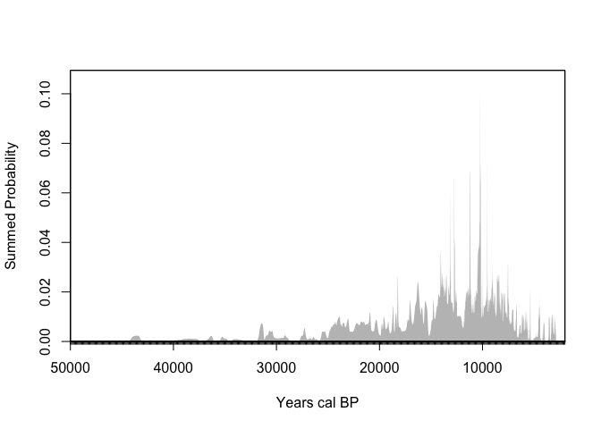
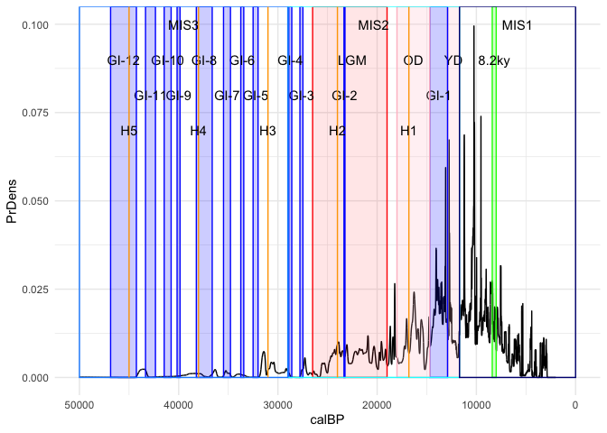
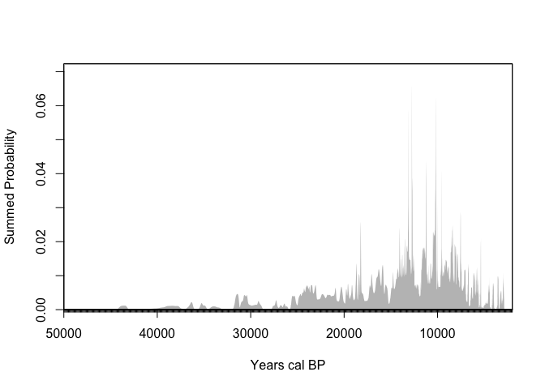
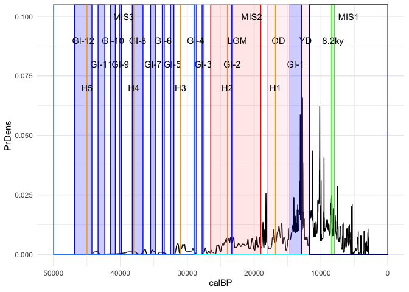
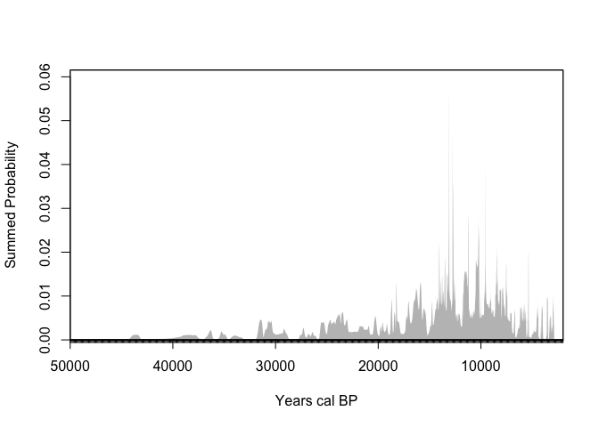
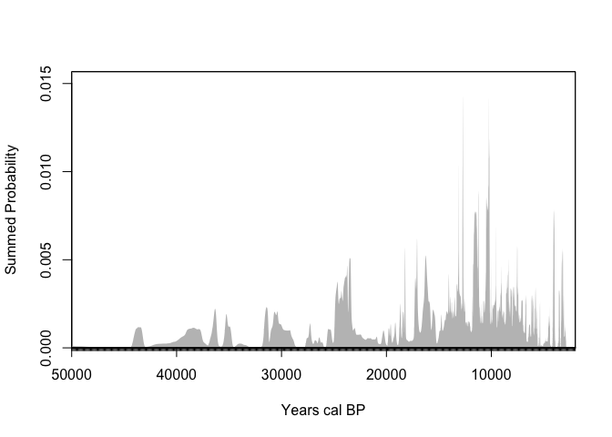
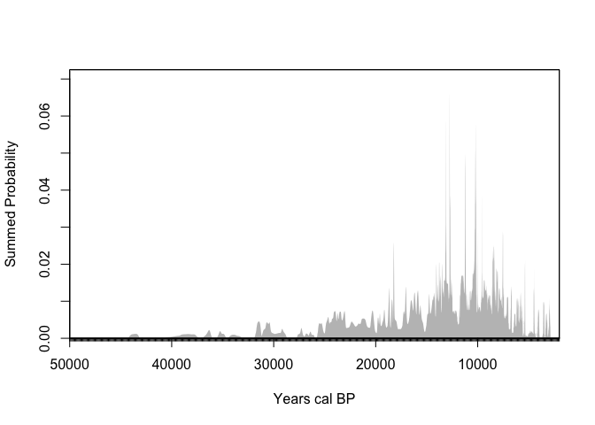
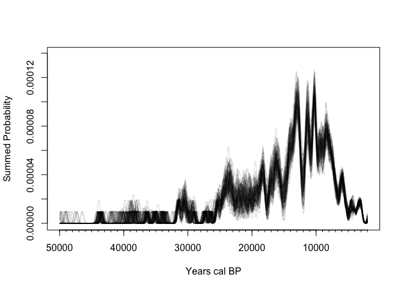
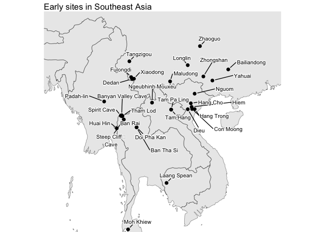

# SPD test


## Data

I gathered 267 uncalibrated radiocarbon ages from 30 Pliestocene to
early Holocene sites across Southeast Asia and southern China. For one
of the Chinese sites Xiaodong I had to uncalibrate the ages using the
built in feature in rcarbon.

## Methods

First we calibrated all the dates using IntCal20 in rcarbon, then we
made summed probability distributions and visualized it in multiple
ways, first without binning. Next to account for well dated sites
overshadowing sites with less amount of dates we binned the data by 100
years, then 200 years, then 500, and finally 5000. Another method used
to account for inter-site variation is thinning where only 1 date from
each bin is chosen to construct the SPD with. A new method used to plot
was composite kernel density estimates where random calendar dates were
sampled from each calibrated date to generate a kernel density estimate,
its done multiple times which all are visualized as an envelope.

``` r
library(tidyverse)
```

    ── Attaching core tidyverse packages ──────────────────────── tidyverse 2.0.0 ──
    ✔ dplyr     1.2.0     ✔ readr     2.1.6
    ✔ forcats   1.0.1     ✔ stringr   1.6.0
    ✔ ggplot2   4.0.2     ✔ tibble    3.3.1
    ✔ lubridate 1.9.5     ✔ tidyr     1.3.2
    ✔ purrr     1.2.1     
    ── Conflicts ────────────────────────────────────────── tidyverse_conflicts() ──
    ✖ dplyr::filter() masks stats::filter()
    ✖ dplyr::lag()    masks stats::lag()
    ℹ Use the conflicted package (<http://conflicted.r-lib.org/>) to force all conflicts to become errors

``` r
library(readxl)
library(rcarbon)
```


    Attaching package: 'rcarbon'

    The following object is masked from 'package:dplyr':

        combine

``` r
# Read excel sheet with dates across Southeast Asia and southern China
dates <- read_excel("Demographic analysis sites.xlsx")

# Calibrate dates using IntCal20
calDates <- calibrate(
  x = dates$C14Age,
  errors = dates$C14SD,
  calCurves = "intcal20",
  verbose = FALSE)
```

## Results

The resulting plots are relatively consistent in peaks and show that
practically every period is accounted for. The consistent increase in
dates after 14,000 BP do call for some investigation which is our
current focus.

``` r
age_range <- c(50000,2000)

# Plotting the summed probability distribution
spd_unbinned <- spd(
  calDates,
  timeRange = age_range)
```

    [1] "Extracting and aggregating..."
    [1] "Done."

``` r
plot(spd_unbinned)

#| label: fig-unbinned-climate
#| fig-cap: Unbinned SPD plot with climate events overlayed 
```



``` r
# with ggplot2
ggplot(spd_unbinned$grid) +
  aes(calBP, PrDens) +
  geom_line() +
  annotate("rect",
           ymin = 0, ymax = Inf,
           xmin = 26500, xmax = 19000,  # df$start[1], df$end[1]
           colour = "red",
           fill = "red",
           alpha = 0.1) +
    annotate("text",
           x = 22500, # midpoint of start and end
           y = 0.09,
           label = "LGM") + # df$event_name[1]
    annotate("rect",
           ymin = 0, ymax = Inf,
           xmin = 12900, xmax = 11700,  
           colour = "pink",
           fill = "pink",
           alpha = 0.2) +
    annotate("text",
           x = 12300, 
           y = 0.09,
           label = "YD") + 
    annotate("rect",
           ymin = 0, ymax = Inf,
           xmin = 14700, xmax = 12900,  
           colour = "blue",
           fill = "blue",
           alpha = 0.2) +
    annotate("text",
           x = 13800, 
           y = 0.08,
           label = "GI-1") + 
    annotate("rect",
           ymin = 0, ymax = Inf,
           xmin = 18000, xmax = 14700,  
           colour = "pink",
           fill = "pink",
           alpha = 0.2) +
    annotate("text",
           x = 16350, 
           y = 0.09,
           label = "OD") + 
    annotate("rect",
           ymin = 0, ymax = Inf,
           xmin = 8400, xmax = 8000,  
           colour = "green",
           fill = "green",
           alpha = 0.2) +
    annotate("text",
           x = 8200, 
           y = 0.09,
           label = "8.2ky") + 
    annotate("rect",
           ymin = 0, ymax = Inf,
           xmin = 23340, xmax = 23240,  
           colour = "blue",
           fill = "blue",
           alpha = 0.2) +
    annotate("text",
           x = 23290, 
           y = 0.08,
           label = "GI-2") + 
    annotate("rect",
           ymin = 0, ymax = Inf,
           xmin = 27780, xmax = 27480,  
           colour = "blue",
           fill = "blue",
           alpha = 0.2) +
    annotate("text",
           x = 27630, 
           y = 0.08,
           label = "GI-3") + 
    annotate("rect",
           ymin = 0, ymax = Inf,
           xmin = 28900, xmax = 28600,  
           colour = "blue",
           fill = "blue",
           alpha = 0.2) +
    annotate("text",
           x = 28750, 
           y = 0.09,
           label = "GI-4") + 
    annotate("rect",
           ymin = 0, ymax = Inf,
           xmin = 32500, xmax = 32000,  
           colour = "blue",
           fill = "blue",
           alpha = 0.2) +
    annotate("text",
           x = 32250, 
           y = 0.08,
           label = "GI-5") + 
    annotate("rect",
           ymin = 0, ymax = Inf,
           xmin = 33740, xmax = 33440,  
           colour = "blue",
           fill = "blue",
           alpha = 0.2) +
    annotate("text",
           x = 33590, 
           y = 0.09,
           label = "GI-6") + 
    annotate("rect",
           ymin = 0, ymax = Inf,
           xmin = 35480, xmax = 34780,  
           colour = "blue",
           fill = "blue",
           alpha = 0.2) +
    annotate("text",
           x = 35130, 
           y = 0.08,
           label = "GI-7") + 
    annotate("rect",
           ymin = 0, ymax = Inf,
           xmin = 38220, xmax = 36620,  
           colour = "blue",
           fill = "blue",
           alpha = 0.2) +
    annotate("text",
           x = 37420, 
           y = 0.09,
           label = "GI-8") + 
    annotate("rect",
           ymin = 0, ymax = Inf,
           xmin = 40160, xmax = 39860,  
           colour = "blue",
           fill = "blue",
           alpha = 0.2) +
    annotate("text",
           x = 40010, 
           y = 0.08,
           label = "GI-9") + 
    annotate("rect",
           ymin = 0, ymax = Inf,
           xmin = 41460, xmax = 40760,  
           colour = "blue",
           fill = "blue",
           alpha = 0.2) +
    annotate("text",
           x = 41110, 
           y = 0.09,
           label = "GI-10") + 
    annotate("rect",
           ymin = 0, ymax = Inf,
           xmin = 43340, xmax = 42340,  
           colour = "blue",
           fill = "blue",
           alpha = 0.2) +
    annotate("text",
           x = 42840, 
           y = 0.08,
           label = "GI-11") + 
    annotate("rect",
           ymin = 0, ymax = Inf,
           xmin = 46860, xmax = 44260,  
           colour = "blue",
           fill = "blue",
           alpha = 0.2) +
    annotate("text",
           x = 45560, 
           y = 0.09,
           label = "GI-12") + 
    annotate("rect",
           ymin = 0, ymax = Inf,
           xmin = 29000, xmax = 11700,  
           colour = "cyan",
           alpha = 0) +
    annotate("text",
           x = 20350, 
           y = 0.1,
           label = "MIS2") + 
    annotate("rect",
           ymin = 0, ymax = Inf,
           xmin = 11700, xmax = 0,  
           colour = "navy",
           alpha = 0) +
    annotate("text",
           x = 5850, 
           y = 0.1,
           label = "MIS1") + 
    annotate("rect",
           ymin = 0, ymax = Inf,
           xmin = 50000, xmax = 29000,  
           colour = "dodgerblue",
           alpha = 0) +
    annotate("text",
           x = 39500, 
           y = 0.1,
           label = "MIS3") + 
    annotate("rect",
           ymin = 0, ymax = Inf,
           xmin = 16800, xmax = 16800,  
           colour = "orange",
           fill = "orange",
           alpha = 0.2) +
    annotate("text",
           x = 16800, 
           y = 0.07,
           label = "H1") + 
    annotate("rect",
           ymin = 0, ymax = Inf,
           xmin = 24000, xmax = 24000,  
           colour = "orange",
           fill = "orange",
           alpha = 0.2) +
    annotate("text",
           x = 24000, 
           y = 0.07,
           label = "H2") + 
    annotate("rect",
           ymin = 0, ymax = Inf,
           xmin = 31000, xmax = 31000,  
           colour = "orange",
           fill = "orange",
           alpha = 0.2) +
    annotate("text",
           x = 31000, 
           y = 0.07,
           label = "H3") + 
    annotate("rect",
           ymin = 0, ymax = Inf,
           xmin = 38000, xmax = 38000,  
           colour = "orange",
           fill = "orange",
           alpha = 0.2) +
    annotate("text",
           x = 38000, 
           y = 0.07,
           label = "H4") + 
    annotate("rect",
           ymin = 0, ymax = Inf,
           xmin = 45000, xmax = 45000,  
           colour = "orange",
           fill = "orange",
           alpha = 0.2) +
    annotate("text",
           x = 45000, 
           y = 0.07,
           label = "H5") + 
  scale_x_reverse() +
  theme_minimal() 
```



In <a href="#fig-unbinned" class="quarto-xref">Figure 1</a> there is a
continuous occupation of Southeast Asia from 25000 BP to present
although there is a more consistent increase in height starting from 14
ka.

``` r
# Grouping dates within 100 years of each other into bins
bins_100 <- binPrep(
  sites = dates$Site,
  ages = dates$C14Age,
  h = 100
)

# Plotting the summed probability distribution with new bins
spd_res <- spd(
  calDates, 
  bins = bins_100,
  timeRange = age_range,
  verbose = FALSE)

plot(spd_res)
```


In <a href="#fig-100-bin" class="quarto-xref">Figure 3</a> the peaks are
consistent but grow more intense the only exceptions being the hills
just before 15 ka and just after 10 ka are a little depressed from the
binning compared to the rest of the peaks.

``` r
# Grouping dates within 200 years of each other into bins
bins_200 <- binPrep(
  sites = dates$Site,
  ages = dates$C14Age,
  h = 200
)

# Plotting the summed probability distribution with new bins
spd_res <- spd(
  calDates, 
  bins = bins_200,
  timeRange = age_range,
  verbose = FALSE)

plot(spd_res)
```



``` r
ggplot(spd_res$grid) +
  aes(calBP, PrDens) +
  geom_line() +
  annotate("rect",
           ymin = 0, ymax = Inf,
           xmin = 26500, xmax = 19000,  # df$start[1], df$end[1]
           colour = "red",
           fill = "red",
           alpha = 0.1) +
    annotate("text",
           x = 22500, # midpoint of start and end
           y = 0.09,
           label = "LGM") + # df$event_name[1]
    annotate("rect",
           ymin = 0, ymax = Inf,
           xmin = 12900, xmax = 11700,  
           colour = "pink",
           fill = "pink",
           alpha = 0.2) +
    annotate("text",
           x = 12300, 
           y = 0.09,
           label = "YD") + 
    annotate("rect",
           ymin = 0, ymax = Inf,
           xmin = 14700, xmax = 12900,  
           colour = "blue",
           fill = "blue",
           alpha = 0.2) +
    annotate("text",
           x = 13800, 
           y = 0.08,
           label = "GI-1") + 
    annotate("rect",
           ymin = 0, ymax = Inf,
           xmin = 18000, xmax = 14700,  
           colour = "pink",
           fill = "pink",
           alpha = 0.2) +
    annotate("text",
           x = 16350, 
           y = 0.09,
           label = "OD") + 
    annotate("rect",
           ymin = 0, ymax = Inf,
           xmin = 8400, xmax = 8000,  
           colour = "green",
           fill = "green",
           alpha = 0.2) +
    annotate("text",
           x = 8200, 
           y = 0.09,
           label = "8.2ky") + 
    annotate("rect",
           ymin = 0, ymax = Inf,
           xmin = 23340, xmax = 23240,  
           colour = "blue",
           fill = "blue",
           alpha = 0.2) +
    annotate("text",
           x = 23290, 
           y = 0.08,
           label = "GI-2") + 
    annotate("rect",
           ymin = 0, ymax = Inf,
           xmin = 27780, xmax = 27480,  
           colour = "blue",
           fill = "blue",
           alpha = 0.2) +
    annotate("text",
           x = 27630, 
           y = 0.08,
           label = "GI-3") + 
    annotate("rect",
           ymin = 0, ymax = Inf,
           xmin = 28900, xmax = 28600,  
           colour = "blue",
           fill = "blue",
           alpha = 0.2) +
    annotate("text",
           x = 28750, 
           y = 0.09,
           label = "GI-4") + 
    annotate("rect",
           ymin = 0, ymax = Inf,
           xmin = 32500, xmax = 32000,  
           colour = "blue",
           fill = "blue",
           alpha = 0.2) +
    annotate("text",
           x = 32250, 
           y = 0.08,
           label = "GI-5") + 
    annotate("rect",
           ymin = 0, ymax = Inf,
           xmin = 33740, xmax = 33440,  
           colour = "blue",
           fill = "blue",
           alpha = 0.2) +
    annotate("text",
           x = 33590, 
           y = 0.09,
           label = "GI-6") + 
    annotate("rect",
           ymin = 0, ymax = Inf,
           xmin = 35480, xmax = 34780,  
           colour = "blue",
           fill = "blue",
           alpha = 0.2) +
    annotate("text",
           x = 35130, 
           y = 0.08,
           label = "GI-7") + 
    annotate("rect",
           ymin = 0, ymax = Inf,
           xmin = 38220, xmax = 36620,  
           colour = "blue",
           fill = "blue",
           alpha = 0.2) +
    annotate("text",
           x = 37420, 
           y = 0.09,
           label = "GI-8") + 
    annotate("rect",
           ymin = 0, ymax = Inf,
           xmin = 40160, xmax = 39860,  
           colour = "blue",
           fill = "blue",
           alpha = 0.2) +
    annotate("text",
           x = 40010, 
           y = 0.08,
           label = "GI-9") + 
    annotate("rect",
           ymin = 0, ymax = Inf,
           xmin = 41460, xmax = 40760,  
           colour = "blue",
           fill = "blue",
           alpha = 0.2) +
    annotate("text",
           x = 41110, 
           y = 0.09,
           label = "GI-10") + 
    annotate("rect",
           ymin = 0, ymax = Inf,
           xmin = 43340, xmax = 42340,  
           colour = "blue",
           fill = "blue",
           alpha = 0.2) +
    annotate("text",
           x = 42840, 
           y = 0.08,
           label = "GI-11") + 
    annotate("rect",
           ymin = 0, ymax = Inf,
           xmin = 46860, xmax = 44260,  
           colour = "blue",
           fill = "blue",
           alpha = 0.2) +
    annotate("text",
           x = 45560, 
           y = 0.09,
           label = "GI-12") + 
    annotate("rect",
           ymin = 0, ymax = Inf,
           xmin = 29000, xmax = 11700,  
           colour = "cyan",
           alpha = 0) +
    annotate("text",
           x = 20350, 
           y = 0.1,
           label = "MIS2") + 
    annotate("rect",
           ymin = 0, ymax = Inf,
           xmin = 11700, xmax = 0,  
           colour = "navy",
           alpha = 0) +
    annotate("text",
           x = 5850, 
           y = 0.1,
           label = "MIS1") + 
    annotate("rect",
           ymin = 0, ymax = Inf,
           xmin = 50000, xmax = 29000,  
           colour = "dodgerblue",
           alpha = 0) +
    annotate("text",
           x = 39500, 
           y = 0.1,
           label = "MIS3") + 
    annotate("rect",
           ymin = 0, ymax = Inf,
           xmin = 16800, xmax = 16800,  
           colour = "orange",
           fill = "orange",
           alpha = 0.2) +
    annotate("text",
           x = 16800, 
           y = 0.07,
           label = "H1") + 
    annotate("rect",
           ymin = 0, ymax = Inf,
           xmin = 24000, xmax = 24000,  
           colour = "orange",
           fill = "orange",
           alpha = 0.2) +
    annotate("text",
           x = 24000, 
           y = 0.07,
           label = "H2") + 
    annotate("rect",
           ymin = 0, ymax = Inf,
           xmin = 31000, xmax = 31000,  
           colour = "orange",
           fill = "orange",
           alpha = 0.2) +
    annotate("text",
           x = 31000, 
           y = 0.07,
           label = "H3") + 
    annotate("rect",
           ymin = 0, ymax = Inf,
           xmin = 38000, xmax = 38000,  
           colour = "orange",
           fill = "orange",
           alpha = 0.2) +
    annotate("text",
           x = 38000, 
           y = 0.07,
           label = "H4") + 
    annotate("rect",
           ymin = 0, ymax = Inf,
           xmin = 45000, xmax = 45000,  
           colour = "orange",
           fill = "orange",
           alpha = 0.2) +
    annotate("text",
           x = 45000, 
           y = 0.07,
           label = "H5") + 
  scale_x_reverse() +
  theme_minimal() 
```



In <a href="#fig-200-bin" class="quarto-xref">Figure 4</a> the changes
are more noticeable as the peak around 13 ka and just before 10 ka is
much higher than the original plot.

``` r
# Grouping dates within 500 years of each other into bins
bins_500 <- binPrep(
  sites = dates$Site,
  ages = dates$C14Age,
  h = 500
)

# Plotting the summed probability distribution with new bins
spd_res <- spd(
  calDates, 
  bins = bins_500,
  timeRange = age_range,
  verbose = FALSE)
plot(spd_res)
```



In <a href="#fig-500-bin" class="quarto-xref">Figure 6</a> the peaks
around 13 ka are even more intense but the hill around 14 ka depresses a
little, the peak just before 10 ka also lowers considerably compared to
the original plot.

``` r
# Grouping dates within 5000 years of each other into bins
bins_5000 <- binPrep(
  sites = dates$Site,
  ages = dates$C14Age,
  h = 5000
)

# Plotting the summed probability distribution with new bins
spd_res <- spd(
  calDates, 
  bins = bins_5000,
  timeRange = age_range,
  verbose = FALSE)
plot(spd_res)
```



In <a href="#fig-5000-bin" class="quarto-xref">Figure 7</a> a lot of the
hills depress however a couple of them spike up into their own peaks
especially around 25-23 ka, 17 ka, and 12 ka.

``` r
# Grouping dates within 200 years of each other into bins
bins_200 <- binPrep(
  sites = dates$Site,
  ages = dates$C14Age,
  h = 200
)

# Thinning selects 1 random date from each bin
calDates2 = calDates[thinDates(ages = dates$C14Age,
                               errors = dates$C14SD,
                               bins = bins_200,
                               size = 1,
                               method = 'random')]

spd_thin <- spd(
  calDates2,
  timeRange = age_range
)
```

    [1] "Extracting and aggregating..."
    [1] "Done."

``` r
# Plotting the SPD after thinning
plot(spd_thin)
```



In <a href="#fig-thinned" class="quarto-xref">Figure 8</a> the thinning
caused more mild variation like the 100 and 200 year bins but the peaks
around 13 and 12 ka intensify and the one just after 10 ka depresses.

``` r
# Grouping dates within 200 years of each other into bins
bins_200 <- binPrep(
  sites = dates$Site,
  ages = dates$C14Age,
  h = 200
)

# Randomly sampling from each calibrated date to generate a kernel density estimate
ckde_res = sampleDates(calDates,bins=bins_200,nsim=100,verbose=FALSE)

Sea.ckde = ckde(ckde_res,
                timeRange = age_range,
                bw = 200)

#Plotting the CKDE
plot(Sea.ckde, type = 'multiline')
```



In <a href="#fig-CKDE" class="quarto-xref">Figure 9</a> the bands show a
consistent occupation but support the notion of increased intensity
starting from 14 ka.

``` r
library(tidyverse)
library(readxl)
library(rnaturalearth)
library(rnaturalearthdata)
```


    Attaching package: 'rnaturalearthdata'

    The following object is masked from 'package:rnaturalearth':

        countries110

``` r
library(sf)
```

    Linking to GEOS 3.13.0, GDAL 3.5.3, PROJ 9.5.1; sf_use_s2() is TRUE

``` r
library(ggrepel)

#| label: fig-map
#| fig-cap: Southeast Asia map

# Load site data from Excel file
dates_data <- read_excel("Demographic analysis sites.xlsx")

# Prepare the spatial data by filtering unique sites
sites_sf <- dates_data %>%
  distinct(Site, lat, long) %>%
  st_as_sf(coords = c("long", "lat"), 
           remove = FALSE, 
           crs = 4326)

# Get the map background
world <- ne_countries(scale = "medium", returnclass = "sf")

# Generate the Map, focus on Southeast Asia, and label sites clearly 
sea_map <- ggplot(world) +
  geom_sf() +
  geom_sf(data = sites_sf, size = 2) +
  coord_sf(xlim = c(90, 115), 
           ylim = c(8, 30), 
           expand = FALSE) +
  geom_text_repel(data = sites_sf,
                  aes(x = long, y = lat, label = Site),
                  max.overlaps = Inf,
                  size = 3, 
                  nudge_x = 0.5,
                  force = 10,
                  point.padding = 0.5,
                  box.padding = 0.5,
                  min.segment.length = 0,
                  bg.color = "white",
                  bg.r = 0.15) +
  theme_void() +
  labs(title = "Early sites in Southeast Asia") 

sea_map
```


