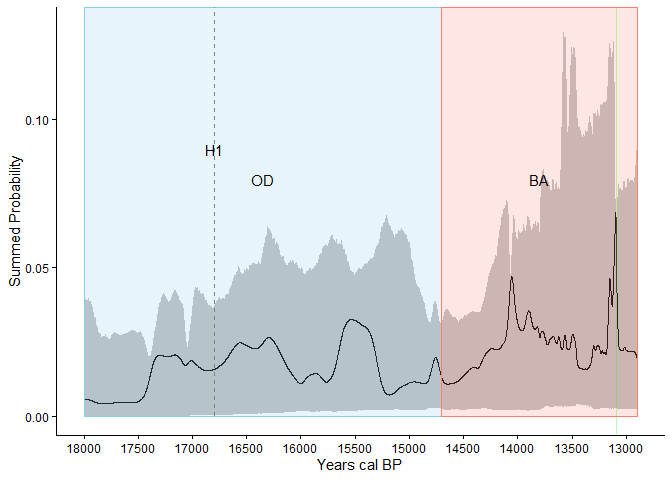
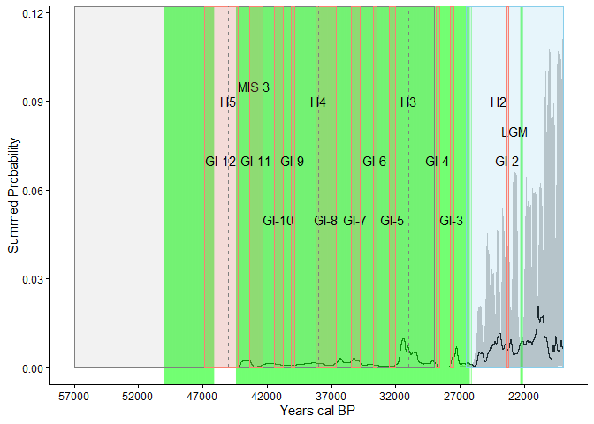

# Using radiocarbon ages as a proxy for human population dynamics in
late Pleistocene mainland Southeast Asia


``` r
library(tidyverse)
```

    ── Attaching core tidyverse packages ──────────────────────── tidyverse 2.0.0 ──
    ✔ dplyr     1.2.0     ✔ readr     2.1.6
    ✔ forcats   1.0.1     ✔ stringr   1.6.0
    ✔ ggplot2   4.0.2     ✔ tibble    3.3.1
    ✔ lubridate 1.9.5     ✔ tidyr     1.3.2
    ✔ purrr     1.2.1     
    ── Conflicts ────────────────────────────────────────── tidyverse_conflicts() ──
    ✖ dplyr::filter() masks stats::filter()
    ✖ dplyr::lag()    masks stats::lag()
    ℹ Use the conflicted package (<http://conflicted.r-lib.org/>) to force all conflicts to become errors

``` r
library(readxl)
library(rcarbon)
```


    Attaching package: 'rcarbon'

    The following object is masked from 'package:dplyr':

        combine

``` r
# Read excel sheet with dates across Southeast Asia and southern China
dates <- read_excel("Demographic analysis sites.xlsx")

# Calibrate dates using IntCal20
calDates <- calibrate(
  x = dates$C14Age,
  errors = dates$C14SD,
  calCurves = "intcal20",
  verbose = FALSE)
```

## Introduction

## Background

## Data

I gathered 352 uncalibrated radiocarbon ages from 30 Pliestocene to
early Holocene sites across Southeast Asia and southern China. For one
of the Chinese sites Xiaodong I had to uncalibrate the ages using the
built in feature in rcarbon.

## Methods

First we calibrated all the dates using IntCal20 in rcarbon, then we
made summed probability distributions and visualized it in multiple
ways, first without binning. Next to account for well dated sites
overshadowing sites with less amount of dates we binned the data by 100
years, then 200 years, then 500, and finally 5000. Another method used
to account for inter-site variation is thinning where only 1 date from
each bin is chosen to construct the SPD with. A new method used to plot
was composite kernel density estimates where random calendar dates were
sampled from each calibrated date to generate a kernel density estimate,
its done multiple times which all are visualized as an envelope. After
the initial SPD plots we decided to evaluate these our findings with a
Monte-Carlo simulation approach to check if taphonomic loss and
calibration process affected the shape of the plot. With an exponential
growth model our Monte-Carlo simulations were used to check 5 timelines,
Oldest Dryas to Bølling–Allerød Interstadial, Bølling–Allerød
Interstadial to Younger Dryas, Marine Isotope 3 to Last Glacial Maximum,
, 50,000 years ago to 8.2-kiloyear event and Last Glacial Maximum to
8.2-kiloyear event

## Results

The resulting plots are relatively consistent in peaks and show that
practically every period is accounted for. The consistent increase in
dates after 14,000 BP do call for some investigation which is our
current focus.

``` r
age_range <- c(50000,2000)

spd_unbinned <- spd(
  calDates,
  timeRange = age_range)
```

    [1] "Extracting and aggregating..."
    [1] "Done."

``` r
climate_events <- read_excel("Demographic analysis sites.xlsx",
                             sheet = 2) |> 
  mutate(midpoint = `End year` + ( `Start year` - `End year`) / 2 )


# with ggplot2
#| label: fig-unbinned-climate
#| fig-cap: Unbinned SPD plot with climate events overlayed 

climate_events <- read_excel("Demographic analysis sites.xlsx", sheet = 2) |>
  filter(!is.na(`Climate event`)) |>
  mutate(
    Abbreviation = as.character(Abbreviation),
    midpoint = `End year` + (`Start year` - `End year`) / 2,
    colour = case_when(
      Condition == "warmer" ~ "salmon",
      Condition == "cooler" ~ "skyblue",
      is.na(Condition)      ~ "grey50"
    ),
    ymax = case_when(
  Abbreviation %in% c("LGM", "OD", "BA", "YD", "8.2k") ~ 0.09,
  is.na(Condition) ~ Inf,
  row_number() %% 2 == 0 ~ 0.08,
  TRUE ~ 0.06
    ),
    y_text = case_when(
  Abbreviation %in% c("MIS 3", "MIS 2", "MIS 1") ~ 0.095,
  Abbreviation %in% c("LGM", "OD", "BA", "YD", "8.2k") ~ 0.08,
  is.na(Condition) ~ 0.09,  # Heinrich events
  row_number() %% 2 == 0 ~ 0.07,
  TRUE ~ 0.05
    )
  )

climate_layers <- lapply(seq_len(nrow(climate_events)), function(i) {
  e <- climate_events[i, ]
  if (e$`Start year` == e$`End year`) {
    # Point events like Heinrich events → vertical line
    list(
      annotate("segment",
               x = e$`Start year`, xend = e$`Start year`,
               y = 0, yend = Inf,
               colour = "grey50", linetype = "dashed"),
      annotate("text",
               x = e$midpoint, y = 0.09,
               label = e$Abbreviation)
    )
  } else {
    list(
      annotate("rect",
               ymin = 0, ymax = e$ymax,
               xmin = e$`Start year`, xmax = e$`End year`,
               colour = e$colour, fill = e$colour,
               alpha = if_else(is.na(e$Condition), 0.1, 0.2)),
      annotate("text",
               x = e$midpoint, y = e$y_text,
               label = e$Abbreviation)
    )
  }
})

# Define this once alongside climate_events and climate_layers
climate_layers_for <- function(start_bp, end_bp) {
  events <- climate_events |> 
    filter(`Start year` <= start_bp & `End year` >= end_bp)
  
  lapply(seq_len(nrow(events)), function(i) {
    e <- events[i, ]
    if (e$`Start year` == e$`End year`) {
      list(
        annotate("segment",
                 x = e$`Start year`, xend = e$`Start year`,
                 y = 0, yend = Inf,
                 colour = "grey50", linetype = "dashed"),
        annotate("text",
                 x = e$midpoint, y = 0.09,
                 label = e$Abbreviation)
      )
    } else {
      list(
        annotate("rect",
                 ymin = 0, ymax = Inf,
                 xmin = e$`Start year`, xmax = e$`End year`,
                 colour = e$colour, fill = e$colour,
                 alpha = if_else(is.na(e$Condition), 0.1, 0.2)),
        annotate("text",
                 x = e$midpoint, y = e$y_text,
                 label = e$Abbreviation)
      )
    }
  })
}


ggplot(spd_unbinned$grid) +
  aes(calBP, PrDens) +
  geom_line() +
  climate_layers+
  scale_x_reverse() +
  theme_minimal() 
```

<div id="fig-unbinned-climate">


Figure 1: Unbinned SPD plot with climate events overlayed

</div>

In <a href="#fig-unbinned-climate" class="quarto-xref">Figure 1</a>
there is a continuous occupation of Southeast Asia from 25000 BP to
present although there is a more consistent increase in height starting
from 14 ka.

``` r
# Initial Monte Carlo test for OD to BA
expnull <- modelTest(calDates, 
                      errors = dates$C14SD, 
                      model = "exponential", 
                      timeRange = c(18000, 12900), 
                      verbose = FALSE,
                      nsim = 100)
```

    Warning in modelTest(calDates, errors = dates$C14SD, model = "exponential", :
    Direct model fitting on SPDs can lead to biased estimates and Null Hypothesis

    Warning in modelTest(calDates, errors = dates$C14SD, model = "exponential", :
    edgeSize reduced

``` r
plot_df <- expnull$result
#Annotating climate events
ggplot(plot_df, aes(x = calBP)) +
  geom_ribbon(aes(ymin = lo, ymax = hi), fill = "grey70", alpha = 0.8) +
  geom_line(aes(y = PrDens), colour = "black") +
  # Highlight periods where observed exceeds envelope
  geom_vline(
    data = subset(plot_df, PrDens > hi | PrDens < lo),
    aes(xintercept = calBP),
    colour = "green", alpha = 0.3, linewidth = 0.3
  ) +
  scale_x_reverse(
    limits = c(18000, 12900),
    breaks = seq(18000, 13000, by = -1000)
  ) +
  labs(x = "Years cal BP", y = "Summed Probability") +
  climate_layers_for(18000, 12900)+
  theme_classic()
```

<div id="fig-MTCL1">


Figure 2: Monte Carlo test of OD-BA with 100 simulations

</div>

<a href="#fig-MTCL1" class="quarto-xref">Figure 2</a> shows our testing
from the Oldest Dryas to Bølling–Allerød Interstadial, we see 2 minor
deviations where the line goes above the envelope near 14.1ka and
13.1ka.

``` r
# Initial Monte Carlo test for OD to BA with 1000 simulations
expnull1000 <- modelTest(calDates, 
                      errors = dates$C14SD, 
                      model = "exponential", 
                      timeRange = c(18000, 12900), 
                      verbose = FALSE,
                      nsim = 1000)
```

    Warning in modelTest(calDates, errors = dates$C14SD, model = "exponential", :
    Direct model fitting on SPDs can lead to biased estimates and Null Hypothesis

    Warning in modelTest(calDates, errors = dates$C14SD, model = "exponential", :
    edgeSize reduced

``` r
plot_df1000 <- expnull1000$result
# Annotating climate events
ggplot(plot_df1000, aes(x = calBP)) +
  geom_ribbon(aes(ymin = lo, ymax = hi), fill = "grey70", alpha = 0.8) +
  geom_line(aes(y = PrDens), colour = "black") +
  # Highlight periods where observed exceeds envelope
  geom_vline(
    data = subset(plot_df1000, PrDens > hi | PrDens < lo),
    aes(xintercept = calBP),
    colour = "green", alpha = 0.3, linewidth = 0.3
  ) +
  scale_x_reverse(
    limits = c(18000, 12900),
    breaks = seq(18000, 13000, by = -500)
  ) +
  labs(x = "Years cal BP", y = "Summed Probability") +
  climate_layers_for(18000, 12900)+
  theme_classic()
```

<div id="fig-MTCL1000">



Figure 3: Monte Carlo test of OD-BA with 1000 simulations

</div>

In <a href="#fig-MTCL1000" class="quarto-xref">Figure 3</a> we increased
the simulations to 1000, the 2 deviations still exist and the line falls
in the expected envelope through the whole time.

``` r
# Initial Monte Carlo test for BA-YD
expnull2 <- modelTest(calDates, 
                      errors = dates$C14SD, 
                      model = "exponential", 
                      timeRange = c(15000, 11000), 
                      verbose = FALSE,
                      nsim = 100)
```

    Warning in modelTest(calDates, errors = dates$C14SD, model = "exponential", :
    Direct model fitting on SPDs can lead to biased estimates and Null Hypothesis

    Warning in modelTest(calDates, errors = dates$C14SD, model = "exponential", :
    edgeSize reduced

``` r
plot_df2 <- expnull2$result

# Annotating climate events
ggplot(plot_df2, aes(x = calBP)) +
  geom_ribbon(aes(ymin = lo, ymax = hi), fill = "grey70", alpha = 0.8) +
  geom_line(aes(y = PrDens), colour = "black") +
  # Highlight periods where observed exceeds envelope
  geom_vline(
    data = subset(plot_df2, PrDens > hi | PrDens < lo),
    aes(xintercept = calBP),
    colour = "green", alpha = 0.3, linewidth = 0.3
  ) +
  scale_x_reverse(
    limits = c(15000, 11000),
    breaks = seq(15000, 11000, by = -500)
  ) +
  labs(x = "Years cal BP", y = "Summed Probability") +
  climate_layers_for(15000, 11000)+
  theme_classic()
```

<div id="fig-MTCL2">


Figure 4: Monte Carlo test of BA-YD with 100 simulations

</div>

<a href="#fig-MTCL2" class="quarto-xref">Figure 4</a> shows our testing
from Bølling–Allerød Interstadial to Younger Dryas, the same deviation
near 13.1ka is seen again while there is a new one in the Younger Dryas
near 12.9ka.

``` r
# Initial Monte Carlo test for 50ka to LGM
expnull3 <- modelTest(calDates, 
                      errors = dates$C14SD, 
                      model = "exponential", 
                      timeRange = c(50000, 19000), 
                      verbose = FALSE,
                      nsim = 100)
```

    Warning in modelTest(calDates, errors = dates$C14SD, model = "exponential", :
    Direct model fitting on SPDs can lead to biased estimates and Null Hypothesis

    Warning in modelTest(calDates, errors = dates$C14SD, model = "exponential", :
    edgeSize reduced

``` r
plot_df3 <- expnull3$result
# Annotating climate events
ggplot(plot_df3, aes(x = calBP)) +
  geom_ribbon(aes(ymin = lo, ymax = hi), fill = "grey70", alpha = 0.8) +
  geom_line(aes(y = PrDens), colour = "black") +
  # Highlight periods where observed exceeds envelope
  geom_vline(
    data = subset(plot_df3, PrDens > hi | PrDens < lo),
    aes(xintercept = calBP),
    colour = "green", alpha = 0.01, linewidth = 0.1
  ) +
  scale_x_reverse(
    limits = c(57000, 19000),
    breaks = seq(57000, 19000, by = -5000)
  ) +
  labs(x = "Years cal BP", y = "Summed Probability") +
  climate_layers_for(57000, 19000)+
  theme_classic()
```

<div id="fig-MTCL3">



Figure 5: Monte Carlo test of MIS3-LGM with 100 simulations

</div>

<a href="#fig-MTCL3" class="quarto-xref">Figure 5</a> shows our test
from MIS3 to LGM, there is a positive deviation nearly the entire time
up to the LGM

``` r
# Initial Monte Carlo test for 50ka to 8.2
expnull4 <- modelTest(calDates, 
                      errors = dates$C14SD, 
                      model = "exponential", 
                      timeRange = c(50000, 8000), 
                      verbose = FALSE,
                      nsim = 100)
```

    Warning in modelTest(calDates, errors = dates$C14SD, model = "exponential", :
    Direct model fitting on SPDs can lead to biased estimates and Null Hypothesis

    Warning in modelTest(calDates, errors = dates$C14SD, model = "exponential", :
    edgeSize reduced

``` r
plot_df4 <- expnull4$result

# Annotating climate events
ggplot(plot_df4, aes(x = calBP)) +
  geom_ribbon(aes(ymin = lo, ymax = hi), fill = "grey70", alpha = 0.8) +
  geom_line(aes(y = PrDens), colour = "black") +
  # Highlight periods where observed exceeds envelope
  geom_vline(
    data = subset(plot_df4, PrDens > hi),
    aes(xintercept = calBP),
    colour = "green", alpha = 0.01, linewidth = 0.1
  ) +
  geom_vline(
    data = subset(plot_df4, PrDens < lo),
    aes(xintercept = calBP),
    color = "blue", alpha = 0.01, linewidth = 0.1
  )+
  scale_x_reverse(
    limits = c(50000, 8000),
    breaks = seq(50000, 8000, by = -5000)
  ) +
  labs(x = "Years cal BP", y = "Summed Probability") +
  climate_layers_for(50000, 8000)+
  theme_classic()
```

<div id="fig-MTCL4">


Figure 6: Monte Carlo test of 50K-8.2k with 100 simulations

</div>

<a href="#fig-MTCL4" class="quarto-xref">Figure 6</a> shows our test
from 50ka to the 8.2 kiloyear event, we can also see a near constant
positive deviation up to the MIS2 then a few positive deviations during
the LGM and then the line follows the envelope until the 8.2 kiloyear
event where there is a negative deviation.

``` r
# Initial Monte Carlo test for LGM to 8.2
expnull5 <- modelTest(calDates, 
                      errors = dates$C14SD, 
                      model = "exponential", 
                      timeRange = c(26500, 8000), 
                      verbose = FALSE,
                      nsim = 100)
```

    Warning in modelTest(calDates, errors = dates$C14SD, model = "exponential", :
    Direct model fitting on SPDs can lead to biased estimates and Null Hypothesis

    Warning in modelTest(calDates, errors = dates$C14SD, model = "exponential", :
    edgeSize reduced

``` r
plot_df5 <- expnull5$result

# Annotating climate events
ggplot(plot_df5, aes(x = calBP)) +
  geom_ribbon(aes(ymin = lo, ymax = hi), fill = "grey70", alpha = 0.8) +
  geom_line(aes(y = PrDens), colour = "black") +
  # Highlight periods where observed exceeds envelope
  geom_vline(
    data = subset(plot_df5, PrDens > hi),
    aes(xintercept = calBP),
    colour = "green", alpha = 0.3, linewidth = 0.3
  ) +
  geom_vline(
    data = subset(plot_df4, PrDens < lo),
    aes(xintercept = calBP),
    color = "blue", alpha = 0.01, linewidth = 0.1
  )+
  scale_x_reverse(
    limits = c(26500, 8000),
    breaks = seq(26500, 8000, by = -5000)
  ) +
  labs(x = "Years cal BP", y = "Summed Probability") +
  climate_layers_for(26500, 8000)+
  theme_classic()
```

<div id="fig-MTCL5">


Figure 7: Monte Carlo test of LGM-8.2k with 100 simulations

</div>

<a href="#fig-MTCL5" class="quarto-xref">Figure 7</a> shows our test for
LGM to the 8.2 kiloyear event there are a few minor positive deviations
near 23ka, 24ka, 18ka, 16ka, 13ka, and a few minor negative deviations
near the 8.2 kiloyear event.

``` r
# Grouping dates within 200 years of each other into bins
bins_200 <- binPrep(
  sites = dates$Site,
  ages = dates$C14Age,
  h = 200
)

# Plotting the summed probability distribution with new bins
spd_res <- spd(
  calDates, 
  bins = bins_200,
  timeRange = age_range,
  verbose = FALSE)
```

``` r
ggplot(spd_res$grid) +
  aes(calBP, PrDens) +
  geom_line() +
  climate_layers+
  scale_x_reverse() +
  theme_minimal() 
```

<div id="fig-200-bin-climate">


Figure 8: SPD plot with a bin of 200 years with climate events overlayed

</div>

In <a href="#fig-200-bin-climate" class="quarto-xref">Figure 8</a> the
changes are more noticeable as the peak around 13 ka and just before 10
ka is much higher than the original plot.

``` r
library(tidyverse)
library(readxl)
library(rnaturalearth)
library(rnaturalearthdata)
```


    Attaching package: 'rnaturalearthdata'

    The following object is masked from 'package:rnaturalearth':

        countries110

``` r
library(sf)
```

    Linking to GEOS 3.13.1, GDAL 3.11.4, PROJ 9.7.0; sf_use_s2() is TRUE

``` r
library(ggrepel)

# Load site data from Excel file
dates_data <- read_excel("Demographic analysis sites.xlsx")

# Prepare the spatial data by filtering unique sites
sites_sf <- dates_data %>%
  distinct(Site, lat, long) %>%
  st_as_sf(coords = c("long", "lat"), 
           remove = FALSE, 
           crs = 4326)

# Get the map background
world <- ne_countries(scale = "medium", returnclass = "sf")

# Generate the Map, focus on Southeast Asia, and label sites clearly 
sea_map <- ggplot(world) +
  geom_sf() +
  geom_sf(data = sites_sf, size = 2) +
  coord_sf(xlim = c(90, 115), 
           ylim = c(8, 30), 
           expand = FALSE) +
  geom_text_repel(data = sites_sf,
                  aes(x = long, y = lat, label = Site),
                  max.overlaps = Inf,
                  size = 3, 
                  nudge_x = 0.5,
                  force = 10,
                  point.padding = 0.5,
                  box.padding = 0.5,
                  min.segment.length = 0,
                  bg.color = "white",
                  bg.r = 0.15) +
  theme_void() +
  labs(title = "Early sites in Southeast Asia") 

sea_map
```

<div id="fig-map">


Figure 9: Map of early sites in Southeast Asia

</div>

In <a href="#fig-map" class="quarto-xref">Figure 9</a> are all the sites
in early Mainland Southeast Asia used in this study

``` r
# Filter for sites older than 30,000 BP
earliest_sites <- dates_data %>%
  filter(C14Age > 30000) %>%
  distinct(Site, lat, long) %>%
  st_as_sf(coords = c("long", "lat"), 
           remove = FALSE, 
           crs = 4326)

# Base map of Southeast Asia
world <- ne_countries(scale = "medium", returnclass = "sf")

# Plot earliest sites
early_sea_map <-ggplot(world) +
  geom_sf() +
  geom_sf(data = earliest_sites, size = 2) +
  coord_sf(xlim = c(90, 115), 
           ylim = c(8, 30), 
           expand = FALSE) +
  geom_text_repel(data = earliest_sites,
                  aes(x = long, y = lat, label = Site),
                  max.overlaps = Inf,
                  size = 3, 
                  nudge_x = 0.5,
                  force = 10,
                  point.padding = 0.5,
                  box.padding = 0.5,
                  min.segment.length = 0,
                  bg.color = "white",
                  bg.r = 0.15) +
  theme_void() +
  labs(title = "Sites older than 30 ka") 

early_sea_map
```

<div id="fig-early-map">


Figure 10: Sites older than 30,000 BP

</div>

In <a href="#fig-early-map" class="quarto-xref">Figure 10</a> the oldest
sites from before 30,000 are shown

``` r
# Filter for sites after the 14 ka event
sites_after_14ka <- dates_data %>%
  filter(C14Age <= 13000) %>%
  distinct(Site, lat, long) %>%
  st_as_sf(coords = c("long", "lat"), 
           remove = FALSE, 
           crs = 4326)

# Plot the after 14 ka sites
sea_map_after_14ka <-ggplot(world) +
  geom_sf() +
  geom_sf(data = sites_after_14ka, size = 2) +
  coord_sf(xlim = c(90, 115), 
           ylim = c(8, 30), 
           expand = FALSE) +
  geom_text_repel(data = sites_after_14ka,
                  aes(x = long, y = lat, label = Site),
                  max.overlaps = Inf,
                  size = 3, 
                  nudge_x = 0.5,
                  force = 10,
                  point.padding = 0.5,
                  box.padding = 0.5,
                  min.segment.length = 0,
                  bg.color = "white",
                  bg.r = 0.15) +
  theme_void() +
  labs(title = "Occupation after 13 ka") 

sea_map_after_14ka
```

<div id="fig-after-map">


Figure 11: Sites occupied after the 14 ka population rise

</div>

In <a href="#fig-after-map" class="quarto-xref">Figure 11</a> sites
occupied after 13,000 are shown, notably there is an increase in sites
in southern Mainland Southeast Asia

``` r
# Import the karst data
karst_sf <- st_read("whymap_karst__v1_poly.shp")
```

    Reading layer `whymap_karst__v1_poly' from data source 
      `C:\Users\Brandon Nguyen\Documents\Independent study\whymap_karst__v1_poly.shp' 
      using driver `ESRI Shapefile'
    Simple feature collection with 2805 features and 2 fields
    Geometry type: MULTIPOLYGON
    Dimension:     XY
    Bounding box:  xmin: -178.9248 ymin: -55.3096 xmax: 179.3667 ymax: 83.09874
    Geodetic CRS:  WGS 84

``` r
ggplot(world) +
  geom_sf(fill = "white") +              # Base map
  geom_sf(data = karst_sf,                     # Karst data
          color = "steelblue1",
          fill = "steelblue1",
          alpha = 1, 
          size = 1) +
  geom_sf(data = sites_sf, size = 2) + # Existing sites 
  coord_sf(xlim = c(90, 115), 
           ylim = c(8, 30), 
           expand = FALSE) +
  geom_text_repel(data = sites_sf,
                  aes(x = long, y = lat, label = Site),
                  max.overlaps = Inf,
                  size = 3, 
                  nudge_x = 0.5,
                  force = 10,
                  point.padding = 0.5,
                  box.padding = 0.5,
                  min.segment.length = 0,
                  bg.color = "white",
                  bg.r = 0.15) +
  theme_minimal() +
  labs(title = "Archaeological Sites and Karst Formations")
```

<div id="fig-karst-map">


Figure 12: Early sites with Karst layered on top

</div>

In <a href="#fig-karst-map" class="quarto-xref">Figure 12</a> all sites
are shown with karst formations overlayed
