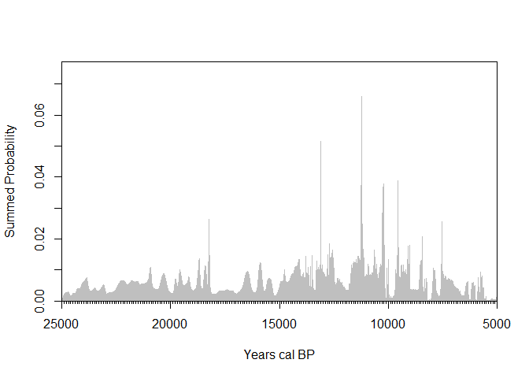
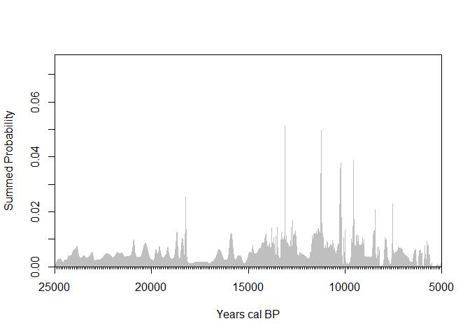
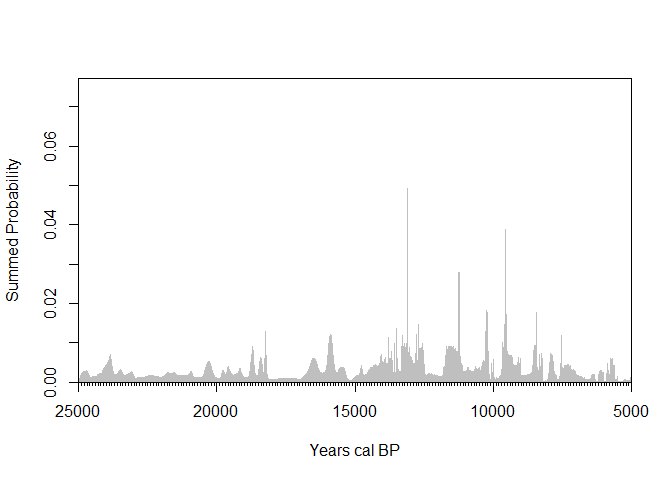
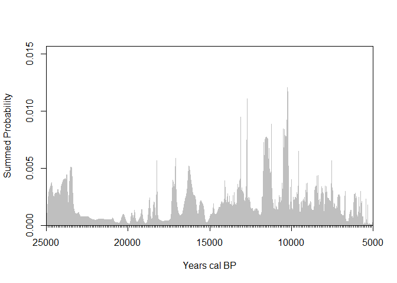
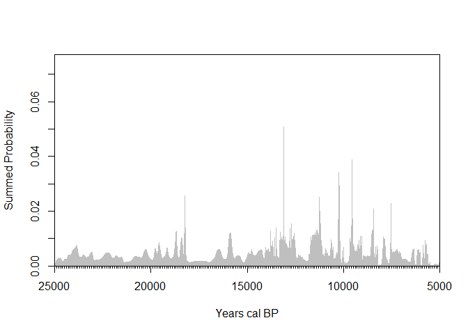
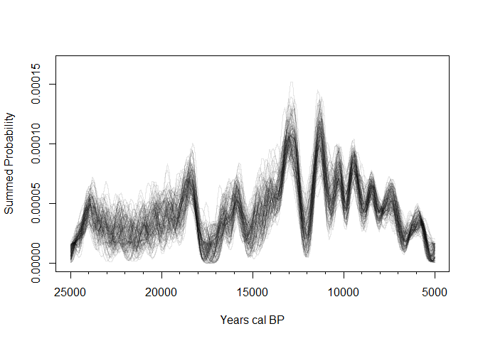

# SPD test


## Data

I gathered 269 uncalibrated radiocarbon ages from 32 Pliestocene to
early Holocene sites across Southeast Asia and southern China. For one
of the Chinese sites Xiaodong I had to uncalibrate the ages using the
built in feature in rcarbon.

## Methods

First we calibrated all the dates using IntCal20 in rcarbon, then we
made summed probability distributions and visualized it in multiple
ways, first without binning. Next to account for well dated sites
overshadowing sites with less amount of dates we binned the data by 100
years, then 200 years, then 500, and finally 5000. Another method used
to account for inter-site variation is thinning where only 1 date from
each bin is chosen to construct the SPD with. A new method used to plot
was composite kernel density estimates where random calendar dates were
sampled from each calibrated date to generate a kernel density estimate,
its done multiple times which all are visualized as an envelope.

``` r
library(readxl)
library(rcarbon)

# Read excel sheet with dates across Southeast Asia and southern China
dates <- read_excel("Demographic analysis sites.xlsx")

# Calibrate dates using IntCal20
calDates <- calibrate(
  x = dates$C14Age,
  errors = dates$C14SD,
  calCurves = "intcal20"  
)
```

    [1] "Calibrating radiocarbon ages..."

      |                                                                            
      |                                                                      |   0%
      |                                                                            
      |                                                                      |   1%
      |                                                                            
      |=                                                                     |   1%
      |                                                                            
      |=                                                                     |   2%
      |                                                                            
      |==                                                                    |   3%
      |                                                                            
      |===                                                                   |   4%
      |                                                                            
      |===                                                                   |   5%
      |                                                                            
      |====                                                                  |   5%
      |                                                                            
      |====                                                                  |   6%
      |                                                                            
      |=====                                                                 |   6%
      |                                                                            
      |=====                                                                 |   7%
      |                                                                            
      |=====                                                                 |   8%
      |                                                                            
      |======                                                                |   8%
      |                                                                            
      |======                                                                |   9%
      |                                                                            
      |=======                                                               |  10%
      |                                                                            
      |========                                                              |  11%
      |                                                                            
      |========                                                              |  12%
      |                                                                            
      |=========                                                             |  12%
      |                                                                            
      |=========                                                             |  13%
      |                                                                            
      |==========                                                            |  14%
      |                                                                            
      |==========                                                            |  15%
      |                                                                            
      |===========                                                           |  16%
      |                                                                            
      |============                                                          |  17%
      |                                                                            
      |============                                                          |  18%
      |                                                                            
      |=============                                                         |  18%
      |                                                                            
      |=============                                                         |  19%
      |                                                                            
      |==============                                                        |  19%
      |                                                                            
      |==============                                                        |  20%
      |                                                                            
      |===============                                                       |  21%
      |                                                                            
      |===============                                                       |  22%
      |                                                                            
      |================                                                      |  23%
      |                                                                            
      |=================                                                     |  24%
      |                                                                            
      |=================                                                     |  25%
      |                                                                            
      |==================                                                    |  25%
      |                                                                            
      |==================                                                    |  26%
      |                                                                            
      |===================                                                   |  27%
      |                                                                            
      |====================                                                  |  28%
      |                                                                            
      |====================                                                  |  29%
      |                                                                            
      |=====================                                                 |  30%
      |                                                                            
      |=====================                                                 |  31%
      |                                                                            
      |======================                                                |  31%
      |                                                                            
      |======================                                                |  32%
      |                                                                            
      |=======================                                               |  32%
      |                                                                            
      |=======================                                               |  33%
      |                                                                            
      |========================                                              |  34%
      |                                                                            
      |=========================                                             |  35%
      |                                                                            
      |=========================                                             |  36%
      |                                                                            
      |==========================                                            |  37%
      |                                                                            
      |==========================                                            |  38%
      |                                                                            
      |===========================                                           |  38%
      |                                                                            
      |===========================                                           |  39%
      |                                                                            
      |============================                                          |  40%
      |                                                                            
      |=============================                                         |  41%
      |                                                                            
      |=============================                                         |  42%
      |                                                                            
      |==============================                                        |  42%
      |                                                                            
      |==============================                                        |  43%
      |                                                                            
      |==============================                                        |  44%
      |                                                                            
      |===============================                                       |  44%
      |                                                                            
      |===============================                                       |  45%
      |                                                                            
      |================================                                      |  45%
      |                                                                            
      |================================                                      |  46%
      |                                                                            
      |=================================                                     |  47%
      |                                                                            
      |==================================                                    |  48%
      |                                                                            
      |==================================                                    |  49%
      |                                                                            
      |===================================                                   |  49%
      |                                                                            
      |===================================                                   |  50%
      |                                                                            
      |===================================                                   |  51%
      |                                                                            
      |====================================                                  |  51%
      |                                                                            
      |====================================                                  |  52%
      |                                                                            
      |=====================================                                 |  53%
      |                                                                            
      |======================================                                |  54%
      |                                                                            
      |======================================                                |  55%
      |                                                                            
      |=======================================                               |  55%
      |                                                                            
      |=======================================                               |  56%
      |                                                                            
      |========================================                              |  56%
      |                                                                            
      |========================================                              |  57%
      |                                                                            
      |========================================                              |  58%
      |                                                                            
      |=========================================                             |  58%
      |                                                                            
      |=========================================                             |  59%
      |                                                                            
      |==========================================                            |  60%
      |                                                                            
      |===========================================                           |  61%
      |                                                                            
      |===========================================                           |  62%
      |                                                                            
      |============================================                          |  62%
      |                                                                            
      |============================================                          |  63%
      |                                                                            
      |=============================================                         |  64%
      |                                                                            
      |=============================================                         |  65%
      |                                                                            
      |==============================================                        |  66%
      |                                                                            
      |===============================================                       |  67%
      |                                                                            
      |===============================================                       |  68%
      |                                                                            
      |================================================                      |  68%
      |                                                                            
      |================================================                      |  69%
      |                                                                            
      |=================================================                     |  69%
      |                                                                            
      |=================================================                     |  70%
      |                                                                            
      |==================================================                    |  71%
      |                                                                            
      |==================================================                    |  72%
      |                                                                            
      |===================================================                   |  73%
      |                                                                            
      |====================================================                  |  74%
      |                                                                            
      |====================================================                  |  75%
      |                                                                            
      |=====================================================                 |  75%
      |                                                                            
      |=====================================================                 |  76%
      |                                                                            
      |======================================================                |  77%
      |                                                                            
      |=======================================================               |  78%
      |                                                                            
      |=======================================================               |  79%
      |                                                                            
      |========================================================              |  80%
      |                                                                            
      |========================================================              |  81%
      |                                                                            
      |=========================================================             |  81%
      |                                                                            
      |=========================================================             |  82%
      |                                                                            
      |==========================================================            |  82%
      |                                                                            
      |==========================================================            |  83%
      |                                                                            
      |===========================================================           |  84%
      |                                                                            
      |============================================================          |  85%
      |                                                                            
      |============================================================          |  86%
      |                                                                            
      |=============================================================         |  87%
      |                                                                            
      |=============================================================         |  88%
      |                                                                            
      |==============================================================        |  88%
      |                                                                            
      |==============================================================        |  89%
      |                                                                            
      |===============================================================       |  90%
      |                                                                            
      |================================================================      |  91%
      |                                                                            
      |================================================================      |  92%
      |                                                                            
      |=================================================================     |  92%
      |                                                                            
      |=================================================================     |  93%
      |                                                                            
      |=================================================================     |  94%
      |                                                                            
      |==================================================================    |  94%
      |                                                                            
      |==================================================================    |  95%
      |                                                                            
      |===================================================================   |  95%
      |                                                                            
      |===================================================================   |  96%
      |                                                                            
      |====================================================================  |  97%
      |                                                                            
      |===================================================================== |  98%
      |                                                                            
      |===================================================================== |  99%
      |                                                                            
      |======================================================================|  99%
      |                                                                            
      |======================================================================| 100%
    [1] "Done."

## Results

The resulting plots are relatively consistent in peaks and show that
practically every period is accounted for. The consistent increase in
dates after 14,000 ka do call for some investigation which is our
current focus.

``` r
# Plotting the summed probability distribution
spd_unbinned <- spd(
  calDates,
  timeRange = c(25000, 5000))
```

    [1] "Extracting and aggregating..."
    [1] "Done."

``` r
plot(spd_unbinned)
```



``` r
# Grouping dates within 100 years of each other into bins
bins_100 <- binPrep(
  sites = dates$Site,
  ages = dates$C14Age,
  h = 100
)

# Plotting the summed probability distribution with new bins
spd_res <- spd(
  calDates, 
  bins = bins_100,
  timeRange = c(25000, 5000))
```

    [1] "Extracting and aggregating..."

      |                                                                            
      |                                                                      |   0%
      |                                                                            
      |=                                                                     |   1%
      |                                                                            
      |=                                                                     |   2%
      |                                                                            
      |==                                                                    |   2%
      |                                                                            
      |==                                                                    |   3%
      |                                                                            
      |===                                                                   |   4%
      |                                                                            
      |===                                                                   |   5%
      |                                                                            
      |====                                                                  |   5%
      |                                                                            
      |====                                                                  |   6%
      |                                                                            
      |=====                                                                 |   7%
      |                                                                            
      |=====                                                                 |   8%
      |                                                                            
      |======                                                                |   9%
      |                                                                            
      |=======                                                               |   9%
      |                                                                            
      |=======                                                               |  10%
      |                                                                            
      |========                                                              |  11%
      |                                                                            
      |========                                                              |  12%
      |                                                                            
      |=========                                                             |  12%
      |                                                                            
      |=========                                                             |  13%
      |                                                                            
      |==========                                                            |  14%
      |                                                                            
      |==========                                                            |  15%
      |                                                                            
      |===========                                                           |  16%
      |                                                                            
      |============                                                          |  17%
      |                                                                            
      |=============                                                         |  18%
      |                                                                            
      |=============                                                         |  19%
      |                                                                            
      |==============                                                        |  20%
      |                                                                            
      |===============                                                       |  21%
      |                                                                            
      |===============                                                       |  22%
      |                                                                            
      |================                                                      |  23%
      |                                                                            
      |=================                                                     |  24%
      |                                                                            
      |==================                                                    |  25%
      |                                                                            
      |==================                                                    |  26%
      |                                                                            
      |===================                                                   |  27%
      |                                                                            
      |====================                                                  |  28%
      |                                                                            
      |====================                                                  |  29%
      |                                                                            
      |=====================                                                 |  30%
      |                                                                            
      |======================                                                |  31%
      |                                                                            
      |======================                                                |  32%
      |                                                                            
      |=======================                                               |  33%
      |                                                                            
      |========================                                              |  34%
      |                                                                            
      |=========================                                             |  35%
      |                                                                            
      |=========================                                             |  36%
      |                                                                            
      |==========================                                            |  37%
      |                                                                            
      |==========================                                            |  38%
      |                                                                            
      |===========================                                           |  38%
      |                                                                            
      |===========================                                           |  39%
      |                                                                            
      |============================                                          |  40%
      |                                                                            
      |============================                                          |  41%
      |                                                                            
      |=============================                                         |  41%
      |                                                                            
      |==============================                                        |  42%
      |                                                                            
      |==============================                                        |  43%
      |                                                                            
      |===============================                                       |  44%
      |                                                                            
      |===============================                                       |  45%
      |                                                                            
      |================================                                      |  45%
      |                                                                            
      |================================                                      |  46%
      |                                                                            
      |=================================                                     |  47%
      |                                                                            
      |=================================                                     |  48%
      |                                                                            
      |==================================                                    |  48%
      |                                                                            
      |==================================                                    |  49%
      |                                                                            
      |===================================                                   |  50%
      |                                                                            
      |====================================                                  |  51%
      |                                                                            
      |====================================                                  |  52%
      |                                                                            
      |=====================================                                 |  52%
      |                                                                            
      |=====================================                                 |  53%
      |                                                                            
      |======================================                                |  54%
      |                                                                            
      |======================================                                |  55%
      |                                                                            
      |=======================================                               |  55%
      |                                                                            
      |=======================================                               |  56%
      |                                                                            
      |========================================                              |  57%
      |                                                                            
      |========================================                              |  58%
      |                                                                            
      |=========================================                             |  59%
      |                                                                            
      |==========================================                            |  59%
      |                                                                            
      |==========================================                            |  60%
      |                                                                            
      |===========================================                           |  61%
      |                                                                            
      |===========================================                           |  62%
      |                                                                            
      |============================================                          |  62%
      |                                                                            
      |============================================                          |  63%
      |                                                                            
      |=============================================                         |  64%
      |                                                                            
      |=============================================                         |  65%
      |                                                                            
      |==============================================                        |  66%
      |                                                                            
      |===============================================                       |  67%
      |                                                                            
      |================================================                      |  68%
      |                                                                            
      |================================================                      |  69%
      |                                                                            
      |=================================================                     |  70%
      |                                                                            
      |==================================================                    |  71%
      |                                                                            
      |==================================================                    |  72%
      |                                                                            
      |===================================================                   |  73%
      |                                                                            
      |====================================================                  |  74%
      |                                                                            
      |====================================================                  |  75%
      |                                                                            
      |=====================================================                 |  76%
      |                                                                            
      |======================================================                |  77%
      |                                                                            
      |=======================================================               |  78%
      |                                                                            
      |=======================================================               |  79%
      |                                                                            
      |========================================================              |  80%
      |                                                                            
      |=========================================================             |  81%
      |                                                                            
      |=========================================================             |  82%
      |                                                                            
      |==========================================================            |  83%
      |                                                                            
      |===========================================================           |  84%
      |                                                                            
      |============================================================          |  85%
      |                                                                            
      |============================================================          |  86%
      |                                                                            
      |=============================================================         |  87%
      |                                                                            
      |=============================================================         |  88%
      |                                                                            
      |==============================================================        |  88%
      |                                                                            
      |==============================================================        |  89%
      |                                                                            
      |===============================================================       |  90%
      |                                                                            
      |===============================================================       |  91%
      |                                                                            
      |================================================================      |  91%
      |                                                                            
      |=================================================================     |  92%
      |                                                                            
      |=================================================================     |  93%
      |                                                                            
      |==================================================================    |  94%
      |                                                                            
      |==================================================================    |  95%
      |                                                                            
      |===================================================================   |  95%
      |                                                                            
      |===================================================================   |  96%
      |                                                                            
      |====================================================================  |  97%
      |                                                                            
      |====================================================================  |  98%
      |                                                                            
      |===================================================================== |  98%
      |                                                                            
      |===================================================================== |  99%
      |                                                                            
      |======================================================================| 100%
    [1] "Done."

``` r
plot(spd_res)
```



``` r
# Grouping dates within 200 years of each other into bins
bins_200 <- binPrep(
  sites = dates$Site,
  ages = dates$C14Age,
  h = 200
)

# Plotting the summed probability distribution with new bins
spd_res <- spd(
  calDates, 
  bins = bins_200,
  timeRange = c(25000, 5000))
```

    [1] "Extracting and aggregating..."

      |                                                                            
      |                                                                      |   0%
      |                                                                            
      |=                                                                     |   1%
      |                                                                            
      |=                                                                     |   2%
      |                                                                            
      |==                                                                    |   3%
      |                                                                            
      |==                                                                    |   4%
      |                                                                            
      |===                                                                   |   4%
      |                                                                            
      |====                                                                  |   5%
      |                                                                            
      |====                                                                  |   6%
      |                                                                            
      |=====                                                                 |   7%
      |                                                                            
      |======                                                                |   8%
      |                                                                            
      |======                                                                |   9%
      |                                                                            
      |=======                                                               |  10%
      |                                                                            
      |========                                                              |  11%
      |                                                                            
      |========                                                              |  12%
      |                                                                            
      |=========                                                             |  12%
      |                                                                            
      |=========                                                             |  13%
      |                                                                            
      |==========                                                            |  14%
      |                                                                            
      |===========                                                           |  15%
      |                                                                            
      |===========                                                           |  16%
      |                                                                            
      |============                                                          |  17%
      |                                                                            
      |============                                                          |  18%
      |                                                                            
      |=============                                                         |  19%
      |                                                                            
      |==============                                                        |  20%
      |                                                                            
      |==============                                                        |  21%
      |                                                                            
      |===============                                                       |  21%
      |                                                                            
      |================                                                      |  22%
      |                                                                            
      |================                                                      |  23%
      |                                                                            
      |=================                                                     |  24%
      |                                                                            
      |==================                                                    |  25%
      |                                                                            
      |==================                                                    |  26%
      |                                                                            
      |===================                                                   |  27%
      |                                                                            
      |===================                                                   |  28%
      |                                                                            
      |====================                                                  |  29%
      |                                                                            
      |=====================                                                 |  29%
      |                                                                            
      |=====================                                                 |  30%
      |                                                                            
      |======================                                                |  31%
      |                                                                            
      |======================                                                |  32%
      |                                                                            
      |=======================                                               |  33%
      |                                                                            
      |========================                                              |  34%
      |                                                                            
      |========================                                              |  35%
      |                                                                            
      |=========================                                             |  36%
      |                                                                            
      |==========================                                            |  37%
      |                                                                            
      |==========================                                            |  38%
      |                                                                            
      |===========================                                           |  38%
      |                                                                            
      |============================                                          |  39%
      |                                                                            
      |============================                                          |  40%
      |                                                                            
      |=============================                                         |  41%
      |                                                                            
      |=============================                                         |  42%
      |                                                                            
      |==============================                                        |  43%
      |                                                                            
      |===============================                                       |  44%
      |                                                                            
      |===============================                                       |  45%
      |                                                                            
      |================================                                      |  46%
      |                                                                            
      |=================================                                     |  47%
      |                                                                            
      |==================================                                    |  48%
      |                                                                            
      |==================================                                    |  49%
      |                                                                            
      |===================================                                   |  50%
      |                                                                            
      |====================================                                  |  51%
      |                                                                            
      |====================================                                  |  52%
      |                                                                            
      |=====================================                                 |  53%
      |                                                                            
      |======================================                                |  54%
      |                                                                            
      |=======================================                               |  55%
      |                                                                            
      |=======================================                               |  56%
      |                                                                            
      |========================================                              |  57%
      |                                                                            
      |=========================================                             |  58%
      |                                                                            
      |=========================================                             |  59%
      |                                                                            
      |==========================================                            |  60%
      |                                                                            
      |==========================================                            |  61%
      |                                                                            
      |===========================================                           |  62%
      |                                                                            
      |============================================                          |  62%
      |                                                                            
      |============================================                          |  63%
      |                                                                            
      |=============================================                         |  64%
      |                                                                            
      |==============================================                        |  65%
      |                                                                            
      |==============================================                        |  66%
      |                                                                            
      |===============================================                       |  67%
      |                                                                            
      |================================================                      |  68%
      |                                                                            
      |================================================                      |  69%
      |                                                                            
      |=================================================                     |  70%
      |                                                                            
      |=================================================                     |  71%
      |                                                                            
      |==================================================                    |  71%
      |                                                                            
      |===================================================                   |  72%
      |                                                                            
      |===================================================                   |  73%
      |                                                                            
      |====================================================                  |  74%
      |                                                                            
      |====================================================                  |  75%
      |                                                                            
      |=====================================================                 |  76%
      |                                                                            
      |======================================================                |  77%
      |                                                                            
      |======================================================                |  78%
      |                                                                            
      |=======================================================               |  79%
      |                                                                            
      |========================================================              |  79%
      |                                                                            
      |========================================================              |  80%
      |                                                                            
      |=========================================================             |  81%
      |                                                                            
      |==========================================================            |  82%
      |                                                                            
      |==========================================================            |  83%
      |                                                                            
      |===========================================================           |  84%
      |                                                                            
      |===========================================================           |  85%
      |                                                                            
      |============================================================          |  86%
      |                                                                            
      |=============================================================         |  87%
      |                                                                            
      |=============================================================         |  88%
      |                                                                            
      |==============================================================        |  88%
      |                                                                            
      |==============================================================        |  89%
      |                                                                            
      |===============================================================       |  90%
      |                                                                            
      |================================================================      |  91%
      |                                                                            
      |================================================================      |  92%
      |                                                                            
      |=================================================================     |  93%
      |                                                                            
      |==================================================================    |  94%
      |                                                                            
      |==================================================================    |  95%
      |                                                                            
      |===================================================================   |  96%
      |                                                                            
      |====================================================================  |  96%
      |                                                                            
      |====================================================================  |  97%
      |                                                                            
      |===================================================================== |  98%
      |                                                                            
      |===================================================================== |  99%
      |                                                                            
      |======================================================================| 100%
    [1] "Done."

``` r
plot(spd_res)
```


``` r
# Grouping dates within 500 years of each other into bins
bins_500 <- binPrep(
  sites = dates$Site,
  ages = dates$C14Age,
  h = 500
)

# Plotting the summed probability distribution with new bins
spd_res <- spd(
  calDates, 
  bins = bins_500,
  timeRange = c(25000, 5000))
```

    [1] "Extracting and aggregating..."

      |                                                                            
      |                                                                      |   0%
      |                                                                            
      |=                                                                     |   1%
      |                                                                            
      |==                                                                    |   2%
      |                                                                            
      |==                                                                    |   3%
      |                                                                            
      |===                                                                   |   5%
      |                                                                            
      |====                                                                  |   6%
      |                                                                            
      |=====                                                                 |   7%
      |                                                                            
      |======                                                                |   8%
      |                                                                            
      |=======                                                               |   9%
      |                                                                            
      |=======                                                               |  10%
      |                                                                            
      |========                                                              |  12%
      |                                                                            
      |=========                                                             |  13%
      |                                                                            
      |==========                                                            |  14%
      |                                                                            
      |===========                                                           |  15%
      |                                                                            
      |===========                                                           |  16%
      |                                                                            
      |============                                                          |  17%
      |                                                                            
      |=============                                                         |  19%
      |                                                                            
      |==============                                                        |  20%
      |                                                                            
      |===============                                                       |  21%
      |                                                                            
      |===============                                                       |  22%
      |                                                                            
      |================                                                      |  23%
      |                                                                            
      |=================                                                     |  24%
      |                                                                            
      |==================                                                    |  26%
      |                                                                            
      |===================                                                   |  27%
      |                                                                            
      |====================                                                  |  28%
      |                                                                            
      |====================                                                  |  29%
      |                                                                            
      |=====================                                                 |  30%
      |                                                                            
      |======================                                                |  31%
      |                                                                            
      |=======================                                               |  33%
      |                                                                            
      |========================                                              |  34%
      |                                                                            
      |========================                                              |  35%
      |                                                                            
      |=========================                                             |  36%
      |                                                                            
      |==========================                                            |  37%
      |                                                                            
      |===========================                                           |  38%
      |                                                                            
      |============================                                          |  40%
      |                                                                            
      |============================                                          |  41%
      |                                                                            
      |=============================                                         |  42%
      |                                                                            
      |==============================                                        |  43%
      |                                                                            
      |===============================                                       |  44%
      |                                                                            
      |================================                                      |  45%
      |                                                                            
      |=================================                                     |  47%
      |                                                                            
      |=================================                                     |  48%
      |                                                                            
      |==================================                                    |  49%
      |                                                                            
      |===================================                                   |  50%
      |                                                                            
      |====================================                                  |  51%
      |                                                                            
      |=====================================                                 |  52%
      |                                                                            
      |=====================================                                 |  53%
      |                                                                            
      |======================================                                |  55%
      |                                                                            
      |=======================================                               |  56%
      |                                                                            
      |========================================                              |  57%
      |                                                                            
      |=========================================                             |  58%
      |                                                                            
      |==========================================                            |  59%
      |                                                                            
      |==========================================                            |  60%
      |                                                                            
      |===========================================                           |  62%
      |                                                                            
      |============================================                          |  63%
      |                                                                            
      |=============================================                         |  64%
      |                                                                            
      |==============================================                        |  65%
      |                                                                            
      |==============================================                        |  66%
      |                                                                            
      |===============================================                       |  67%
      |                                                                            
      |================================================                      |  69%
      |                                                                            
      |=================================================                     |  70%
      |                                                                            
      |==================================================                    |  71%
      |                                                                            
      |==================================================                    |  72%
      |                                                                            
      |===================================================                   |  73%
      |                                                                            
      |====================================================                  |  74%
      |                                                                            
      |=====================================================                 |  76%
      |                                                                            
      |======================================================                |  77%
      |                                                                            
      |=======================================================               |  78%
      |                                                                            
      |=======================================================               |  79%
      |                                                                            
      |========================================================              |  80%
      |                                                                            
      |=========================================================             |  81%
      |                                                                            
      |==========================================================            |  83%
      |                                                                            
      |===========================================================           |  84%
      |                                                                            
      |===========================================================           |  85%
      |                                                                            
      |============================================================          |  86%
      |                                                                            
      |=============================================================         |  87%
      |                                                                            
      |==============================================================        |  88%
      |                                                                            
      |===============================================================       |  90%
      |                                                                            
      |===============================================================       |  91%
      |                                                                            
      |================================================================      |  92%
      |                                                                            
      |=================================================================     |  93%
      |                                                                            
      |==================================================================    |  94%
      |                                                                            
      |===================================================================   |  95%
      |                                                                            
      |====================================================================  |  97%
      |                                                                            
      |====================================================================  |  98%
      |                                                                            
      |===================================================================== |  99%
      |                                                                            
      |======================================================================| 100%
    [1] "Done."

``` r
plot(spd_res)
```



``` r
# Grouping dates within 5000 years of each other into bins
bins_5000 <- binPrep(
  sites = dates$Site,
  ages = dates$C14Age,
  h = 5000
)

# Plotting the summed probability distribution with new bins
spd_res <- spd(
  calDates, 
  bins = bins_5000,
  timeRange = c(25000, 5000))
```

    [1] "Extracting and aggregating..."

      |                                                                            
      |                                                                      |   0%
      |                                                                            
      |==                                                                    |   3%
      |                                                                            
      |====                                                                  |   6%
      |                                                                            
      |=======                                                               |   9%
      |                                                                            
      |=========                                                             |  12%
      |                                                                            
      |===========                                                           |  16%
      |                                                                            
      |=============                                                         |  19%
      |                                                                            
      |===============                                                       |  22%
      |                                                                            
      |==================                                                    |  25%
      |                                                                            
      |====================                                                  |  28%
      |                                                                            
      |======================                                                |  31%
      |                                                                            
      |========================                                              |  34%
      |                                                                            
      |==========================                                            |  38%
      |                                                                            
      |============================                                          |  41%
      |                                                                            
      |===============================                                       |  44%
      |                                                                            
      |=================================                                     |  47%
      |                                                                            
      |===================================                                   |  50%
      |                                                                            
      |=====================================                                 |  53%
      |                                                                            
      |=======================================                               |  56%
      |                                                                            
      |==========================================                            |  59%
      |                                                                            
      |============================================                          |  62%
      |                                                                            
      |==============================================                        |  66%
      |                                                                            
      |================================================                      |  69%
      |                                                                            
      |==================================================                    |  72%
      |                                                                            
      |====================================================                  |  75%
      |                                                                            
      |=======================================================               |  78%
      |                                                                            
      |=========================================================             |  81%
      |                                                                            
      |===========================================================           |  84%
      |                                                                            
      |=============================================================         |  88%
      |                                                                            
      |===============================================================       |  91%
      |                                                                            
      |==================================================================    |  94%
      |                                                                            
      |====================================================================  |  97%
      |                                                                            
      |======================================================================| 100%
    [1] "Done."

``` r
plot(spd_res)
```



``` r
# Grouping dates within 200 years of each other into bins
bins_200 <- binPrep(
  sites = dates$Site,
  ages = dates$C14Age,
  h = 200
)

# Thinning selects 1 random date from each bin
calDates2 = calDates[thinDates(ages = dates$C14Age,
                               errors = dates$C14SD,
                               bins = bins_200,
                               size = 1,
                               method = 'random')]

spd_thin <- spd(
  calDates2,
  timeRange = c(25000, 5000)
)
```

    [1] "Extracting and aggregating..."
    [1] "Done."

``` r
# Plotting the SPD after thinning
plot(spd_thin)
```



``` r
# Grouping dates within 200 years of each other into bins
bins_200 <- binPrep(
  sites = dates$Site,
  ages = dates$C14Age,
  h = 200
)

# Randomly sampling from each calibrated date to generate a kernel density estimate
ckde_res = sampleDates(calDates,bins=bins_200,nsim=100,verbose=FALSE)

Sea.ckde = ckde(ckde_res,
                timeRange = c(25000, 5000),
                bw = 200)
```

    Warning in ckde(ckde_res, timeRange = c(25000, 5000), bw = 200): Simulated
    dates were generated from a dates calibrated with the argument `normalised` set
    to TRUE. The composite KDE will be executed with 'normalised' set to TRUE. To
    obtain a non-normalised composite KDE calibrate setting 'normalised` to FALSE

``` r
#Plotting the CKDE
plot(Sea.ckde, type = 'multiline')
```


